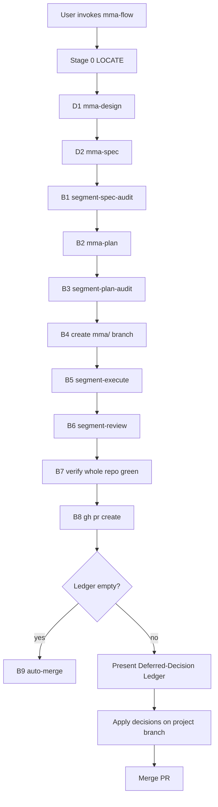

# mma-flow — Packaged SDLC Orchestration Skill for multi-model-agent

### Context

### Background
multi-model-agent (MMA) is a local HTTP service that delegates tool-using work to sub-agents on different LLM providers and ships as the public npm package `@zhixuan92/multi-model-agent`. Users install the package, run `mma serve`, and use `mma sync-skills` to install shipped skills into supported agent clients. At HEAD, the packaged skills cover individual lifecycle stages such as design, specification writing, planning, execution, auditing, review, investigation, debugging, and journal recall, but the package does not ship the orchestration layer that turns those primitives into a full design-to-merged-code software delivery flow.

Today, the end-to-end SDLC flow exists only as the author's local Claude Code assets outside the packaged repository: a Claude Code slash command plus three workflow scripts. Packaged MMA users therefore receive the individual tools but not the choreography that makes those tools the product's primary workflow. This leaves the highest-value capability undiscoverable, non-installable, and dependent on the author's personal setup.

The packaged codebase already contains the building blocks needed for a packaged orchestration skill. `packages/server/src/skills/mma-design/SKILL.md` establishes the precedent for orchestration delivered as a skill rather than a server endpoint. `packages/server/src/skill-install/discover.ts` defines the shipped skill inventory, `packages/server/src/cli/sync-skills.ts` performs idempotent installation and orphan cleanup, and `packages/server/src/skill-install/skill-installers/claude-code.ts` writes Claude Code skills into `~/.claude/skills/<skillName>/SKILL.md`. The feature in this spec packages the missing orchestration layer without changing MMA's stateless per-call server model.

### Problem
MMA's most differentiating workflow, the full SDLC chain from design through merged pull request, is not shipped. Users who install MMA must reverse-engineer how individual skills connect, and the only working orchestration implementation depends on Claude Code-only plugins and personal local files. This reduces adoption, weakens discoverability, and prevents a standard packaged path for design, audit, plan, execute, review, PR, and merge.

### Goals & Requirements

### Goals
1. Ship `mma-flow` as a packaged orchestration skill that installs via `mma sync-skills`.
2. Redesign the flow to be fully MMA-native, with zero dependency on `superpowers:*` or any other non-MMA skill.
3. Add branch management and PR workflow so Build runs on a project branch, reviews against the source branch, creates a PR, and merges under explicit rules.
4. Standardize spec audit, plan audit, and code review around the same iterative loop contract: up to three rounds, early exit when no critical or high findings remain.
5. Preserve MMA's stateless per-call architecture by implementing `mma-flow` as a packaged skill plus client-side workflow helpers, not as a new server task type or endpoint.

### Functional requirements
FR-1. MMA must ship a new packaged orchestration skill at `packages/server/src/skills/mma-flow/SKILL.md`, and `mma sync-skills` must make that skill available to every supported client using the existing per-client installation model.

FR-2. The `mma-flow` skill must be self-contained and fully MMA-native: it must orchestrate only MMA-shipped skills and task types, and it must not reference `superpowers:*` or any other external client plugin dependency.

FR-3. The packaged `mma-flow` skill must define the SDLC pipeline as Stage 0 LOCATE, Design (`D1`, `D2`), and Build (`B1` through `B9`) exactly as follows:
`D1` `mma-design`,
`D2` `mma-spec`,
`B1` spec audit,
`B2` `mma-plan`,
`B3` plan audit,
`B4` project branch creation,
`B5` execute plan,
`B6` code review,
`B7` whole-repo green verification,
`B8` PR creation,
`B9` deferred-decision gate and merge.

FR-4. Stage 0 LOCATE must detect the current coarse-grained stage from durable artifacts, git state, PR state, and current conversation evidence, then resume from the earliest incomplete stage without skipping required work. The skill must treat intra-loop audit/review rounds as workflow-script state, not as independent resumable top-level stages.

FR-5. The Design phase must remain git-free. `D1` must use `mma-design` as the interactive human-gated design workflow, and `D2` must use `mma-spec` to write the formal specification into `docs/mma/specs/`. Git repository validation must not be required before the flow reaches Build.

FR-6. The Build phase must validate that the current working directory is inside a git repository before entering `B1`. If git is unavailable or the working directory is not a git repository, the skill must stop before Build, explain the failure, and leave Design outputs intact.

FR-7. `B1` and `B3` must use Claude Code workflow scripts that implement the same audit-loop contract: dispatch `mma-audit`, inspect findings, optionally dispatch a fix agent for critical and high findings, re-dispatch audit, stop early when a round has zero critical or high findings, and cap total rounds at three.

FR-8. The packaged skill must ship four workflow scripts under `packages/server/src/skills/mma-flow/workflows/`: `segment-spec-audit.js`, `segment-plan-audit.js`, `segment-execute.js`, and `segment-review.js`. `segment-review.js` is new; the other three are packaged, MMA-native redesigns of the existing local-only accelerators.

FR-9. `segment-spec-audit.js` must accept `{ specPath, cwd?, cap?, autofix?, contextBlockId? }` and return `{ specPath, cwd, roundsRun, clean, rounds, openFindings, blockingRemaining, proceed, note, contextBlockId }`. `segment-plan-audit.js` must accept `{ planPath, cwd, cap?, autofix?, contextBlockId? }` and return the same shape with `planPath` in place of `specPath`.

FR-10. `segment-review.js` must accept `{ cwd, sourceBranch, cap?, autofix?, contextBlockId? }` and return `{ cwd, sourceBranch, roundsRun, clean, rounds, openFindings, blockingRemaining, proceed, note, contextBlockId }`. It must review the full diff between the source branch and the project branch, apply fix rounds on the project branch, and follow the same three-round early-exit policy as the audit workflows.

FR-11. `segment-execute.js` must preserve the current grouped-dispatch behavior for `mma-execute-plan`, but it must run with the repository checked out on the project branch created in `B4` so all execution and any follow-on fixes land on that branch.

FR-12. `B4` must create a project branch named `mma/<slug>` from the detected source branch. The slug must be derived from the spec title by lowercasing, converting all non-alphanumeric runs to `-`, collapsing repeated `-`, trimming leading and trailing `-`, and truncating to 30 characters. If truncation would leave an empty slug, the slug must be `task`.

FR-13. `B8` must push the project branch and create a GitHub pull request with `gh pr create --base <sourceBranch> --head mma/<slug>`. The PR title must be `build(<slug>): <one-line spec summary>`. The PR body must include the execution checklist and the final audit/review summary.

FR-14. The Build flow must maintain a Deferred-Decision Ledger across `B1` through `B9`. Each entry must record `item`, `assumptionMade`, `blastRadius`, and `blockedWork`. If the ledger is empty at `B9`, the skill must auto-merge. If the ledger contains one or more entries, the skill must present the ledger to the user, wait for decisions, apply any required code changes on the project branch, and merge only after that human gate completes.

FR-15. `mma sync-skills` for the Claude Code target must install workflow scripts from a packaged skill's `workflows/` subdirectory into `~/.claude/workflows/`, must remove previously installed workflow scripts for that skill that are no longer present in the package, and must continue to install only `SKILL.md` for Gemini, Codex, and Cursor.

FR-16. `packages/server/src/skill-install/discover.ts` must include `mma-flow` in `SUPPORTED_SKILLS`, and `packages/server/src/skills/multi-model-agent/SKILL.md` must document `mma-flow` in the router skill map and best-practices guidance so users can discover the packaged SDLC flow.

### Scope

#### Delivery order
1. **EXEC-1 — packaged orchestration runtime:** add `packages/server/src/skills/mma-flow/SKILL.md` and the four packaged workflow scripts under `packages/server/src/skills/mma-flow/workflows/`. This is the primary buildable unit because it defines the flow contract.
2. **EXEC-2 — Claude Code workflow installation:** extend the Claude Code installer and `mma sync-skills` path so packaged workflow scripts install into `~/.claude/workflows/` and stale packaged workflow scripts are removed. This is a second buildable unit with its own completion gate.
3. **EXEC-3 — discovery and routing exposure:** add `mma-flow` to `SUPPORTED_SKILLS` and update the router skill so packaged users can discover the flow from the existing skill map. This is a third buildable unit with its own completion gate.
4. **GATE-1 — validation evidence:** prove the packaged flow with unit, contract, integration, and live-smoke coverage described in this spec. This is a release gate, not a separate runtime feature.

Blocking prerequisites: none. This feature does not depend on any external code artifact being imported from the author's home directory. The local-only slash command and workflow scripts are historical reference implementations, but the packaged behavior is fully specified in this document and can be implemented entirely from repository-local files.

#### In scope
- Creating `packages/server/src/skills/mma-flow/SKILL.md`.
- Packaging four workflow scripts under `packages/server/src/skills/mma-flow/workflows/`.
- Redesigning the packaged flow so all orchestration uses MMA-native skills and task types.
- Implementing Stage 0 LOCATE, Design, Build, Deferred-Decision Ledger, branch creation, PR creation, and conditional merge behavior inside the `mma-flow` skill contract.
- Extending Claude Code skill installation to copy packaged workflow scripts into `~/.claude/workflows/`.
- Removing stale packaged `mma-flow` workflow scripts from `~/.claude/workflows/` during sync.
- Adding `mma-flow` to packaged skill discovery.
- Updating the router skill to advertise `mma-flow`.
- Tests that prove installer behavior, packaged file presence, workflow parse validity, and an end-to-end smoke path.

#### Out of scope
- Any new server endpoint such as `POST /task { "type": "flow" }`.
- Any change to MMA's stateless per-call server architecture.
- Workflow-script installation for Cursor, Gemini CLI, or Codex CLI.
- Changes to existing MMA task types or route schemas other than using them from the new orchestration skill.
- Changes to Forge, Forge branch naming, or Forge PR automation.
- Persisting orchestration state on the MMA server.
- Any new GUI, TUI, or CLI subcommand named `mma flow`.
- Automatic PR approval rules, CI policy changes, or GitHub repository settings changes.

### Constraints
- Compatibility: all existing skill install targets (`claude-code`, `gemini`, `codex`, `cursor`) must continue to work after `mma-flow` is added.
- Architecture: MMA must remain stateless per call; orchestration lives in packaged skill text and client-side workflow helpers, not server memory or a new task type.
- Client portability: the `mma-flow` `SKILL.md` must be understandable and executable by any supported client even though workflow automation is Claude Code-only.
- Runtime API: Claude Code workflow scripts must use the Claude Code Workflow runtime API surface `agent()`, `parallel()`, `phase()`, and `log()`.
- Repository portability: the Build flow must work in arbitrary git repositories, not only inside the MMA repository.
- Branch naming: project branches must use the prefix `mma/`, never `forge/`.
- Audit/review policy: spec audit, plan audit, and code review must share one policy shape with a round cap of three and early exit when no critical or high findings remain.
- Output locations: specification and plan artifacts must use MMA defaults `docs/mma/specs/` and `docs/mma/plans/`.
- Data safety: the flow must not discard user work on the source branch; all Build-phase changes occur on the project branch after `B4`.

### Success metrics

| Metric | Target | How measured |
|---|---|---|
| Packaged skill availability | `mma-flow` installs on every supported target via `mma sync-skills` | Contract and integration tests covering `SUPPORTED_SKILLS`, install output, and manifest reconciliation |
| Claude Code automation availability | All four packaged workflow scripts are installed into `~/.claude/workflows/` for Claude Code targets | Integration test of `mma sync-skills --target=claude-code` plus installer unit tests |
| MMA-native dependency purity | Zero references to `superpowers:*` in `mma-flow` `SKILL.md` or any packaged workflow script | Static grep in contract tests |
| Audit/review loop efficiency | Spec audit, plan audit, and review stop immediately on first clean round, with maximum three rounds | Workflow unit tests and live smoke logs |
| Build branch correctness | All Build changes land on `mma/<slug>` and PR base remains the detected source branch | Live smoke validation in a test repository |
| Manual portability | A non-Claude client can follow the `mma-flow` `SKILL.md` manually from design through PR creation | Human read-through acceptance against the packaged skill text |

### Alternatives

### Driving factors
1. Preserve MMA's stateless per-call architecture.
2. Ship a flow that works for all supported clients, not only Claude Code.
3. Provide automation for repetitive audit and review loops where a workflow runtime exists.
4. Minimize changes to existing server routes and task-type contracts.
5. Keep the packaged flow self-contained and MMA-native.

### Options
Option A. SKILL.md plus workflow scripts.
Why considered: it matches the existing `mma-design` orchestration pattern while letting Claude Code automate repetitive loop mechanics.
Pros: portable across all clients via `SKILL.md`; optimized for Claude Code through workflow helpers; preserves stateless architecture; reuses existing task types.
Cons: workflow acceleration is Claude Code-only; installer logic becomes more complex because it must manage non-`SKILL.md` assets.

Option B. SKILL.md only, no workflows.
Why considered: it is the smallest packaging change and avoids installer changes.
Pros: simplest implementation; fully portable across clients; no extra Claude Code asset management.
Cons: loses automation for audit and review loops; weakens the user experience for the client that already has a workflow runtime; increases manual orchestration burden.

Option C. New server endpoint for `type: "flow"`.
Why considered: it would provide one uniform entry point and centralize state transitions.
Pros: identical invocation surface across clients; server could persist progress automatically.
Cons: violates the stateless per-call principle; turns MMA into a workflow engine; requires new route, schemas, and server-side orchestration state; exceeds the intended scope.

### Comparison

| Factor | Option A: SKILL.md + workflows | Option B: SKILL.md only | Option C: new endpoint |
|---|---|---|---|
| 1. Stateless architecture | Strong fit | Strong fit | Fails |
| 2. All-client availability | Strong fit | Strong fit | Strong fit |
| 3. Loop automation where available | Strong fit | Weak | Strong fit |
| 4. Change size to existing routes | Small | Smallest | Largest |
| 5. MMA-native self-containment | Strong fit | Strong fit | Medium |
| Verdict | Chosen | Rejected: too manual | Rejected: architecture violation |

### Decision Records
1. **DR-1 — `mma-design` replaces `superpowers:brainstorming`.** Rationale: the packaged flow must be fully MMA-native so installed users do not need Claude Code plugin skills that MMA does not ship.
2. **DR-2 — `mma-plan` replaces `superpowers:writing-plans`.** Rationale: plan writing should be delegated to MMA's worker model so the orchestrated flow remains self-contained and cost-efficient.
3. **DR-3 — `mma-explore` is folded into `mma-design` Phase 1.** Rationale: `mma-design` already offers the necessary investigation entry points, so a separate explore stage would duplicate the same discovery work.
4. **DR-4 — the Deferred-Decision Ledger is retained.** Rationale: autonomous Build needs a structured way to batch human decisions until the end instead of interrupting execution repeatedly.
5. **DR-5 — workflow scripts are shipped via `sync-skills`.** Rationale: Claude Code workflow scripts are accelerators tied to skill installation, so they belong in the same package-distribution path as `SKILL.md`.
6. **DR-6 — spec and plan outputs use MMA defaults `docs/mma/specs/` and `docs/mma/plans/`.** Rationale: the flow should align with the current `spec` and `plan` task-type conventions rather than introduce alternate artifact locations.
7. **DR-7 — code review is included for up to three rounds.** Rationale: the packaged flow is a full SDLC flow, and review must match the same iterative quality bar as spec and plan auditing.
8. **DR-8 — the Design phase is git-free.** Rationale: design and specification can happen before a repository exists, which keeps the packaged flow usable for greenfield or pre-repo work.
9. **DR-9 — audit and review rounds are capped at three and exit early on clean.** Rationale: this preserves rigor without wasting rounds after the quality bar is already met.
10. **DR-10 — the human gate remains inside `mma-design`'s decision-summary confirmation.** Rationale: once design decisions are confirmed, the package should progress autonomously until the Deferred-Decision Ledger requires human input.
11. **DR-11 — the PR is created after `B7`.** Rationale: PRs should reflect a whole-repo-green state rather than an intermediate or knowingly failing branch.
12. **DR-12 — `B9` is a conditional second human gate.** Rationale: human review is required only when the Deferred-Decision Ledger contains unresolved items; otherwise the autonomous flow should finish the merge path without unnecessary interruption.
13. **DR-13 — project branches are named `mma/<slug>`.** Rationale: `forge/` is Forge-specific; `mma/` clearly identifies branches created by this packaged MMA flow.
14. **DR-14 — audit, plan audit, and code review follow the Forge audit-loop policy shape.** Rationale: one shared policy reduces mental overhead and keeps fix/re-review behavior consistent across artifacts.

### Technical Design

### Current state
At git commit `623f8a555aa4df6783f82f52b2aa8777f401a9f9`, the packaged repository contains no `packages/server/src/skills/mma-flow/` directory.

The shipped skill inventory is defined in `packages/server/src/skill-install/discover.ts` as:

```ts
export const SUPPORTED_SKILLS = [
  'multi-model-agent',
  'mma-delegate',
  'mma-audit',
  'mma-review',
  'mma-debug',
  'mma-execute-plan',
  'mma-retry',
  'mma-context-blocks',
  'mma-investigate',
  'mma-research',
  'mma-explore',
  'mma-journal-record',
  'mma-journal-recall',
  'mma-orchestrate',
  'mma-spec',
  'mma-plan',
  'mma-design',
] as const;
```

`packages/server/src/skill-install/discover.ts` also resolves skill content by reading `<skillsRoot>/<skillName>/SKILL.md`, which means any new packaged skill must exist as a directory under `packages/server/src/skills/` with a `SKILL.md` file.

`packages/server/src/skill-install/skill-installers/claude-code.ts` currently exposes:

```ts
export interface ClaudeCodeInstallOpts {
  skillName: string;
  content: string;
  homeDir: string;
  skillsRoot: string;
  authToken?: string;
}

export function installClaudeCode(opts: ClaudeCodeInstallOpts): void;
export function uninstallClaudeCode(skillName: string, homeDir: string): void;
```

Its current behavior is limited to writing a single file to:

```text
<homeDir>/.claude/skills/<skillName>/SKILL.md
```

It does not inspect a skill-specific `workflows/` subdirectory and does not write anything to `~/.claude/workflows/`.

`packages/server/src/skill-install/manifest.ts` defines the supported install targets and detection rules:

```ts
export type Client = 'claude-code' | 'gemini' | 'codex' | 'cursor';
export const ALL_CLIENTS: readonly Client[] = ['claude-code', 'gemini', 'codex', 'cursor'];
```

`packages/server/src/cli/sync-skills.ts` performs two passes: orphan removal for skills missing from `SUPPORTED_SKILLS`, then canonical upsert for each skill in `SUPPORTED_SKILLS` across resolved targets. It reads the installed version from `<client install dir>/<skillName>/SKILL.md`, so workflow installation currently has no first-class version or reconciliation contract.

`packages/server/src/skill-install/skill-installer-common.ts` routes installation by client target. `writeSkillToClient()` calls `installClaudeCode()` for the `claude-code` target, `installGeminiCli()` for `gemini`, `installCodexCli()` for `codex`, and `installCursor()` for `cursor`. No client other than Claude Code has a directory model suitable for installing standalone workflow scripts.

`packages/server/src/skills/multi-model-agent/SKILL.md` is the packaged router skill. It documents the current skill map and best practices, but it does not mention `mma-flow`. `packages/server/src/skills/mma-design/SKILL.md` already demonstrates MMA's orchestration pattern: it is explicitly not an endpoint and instead teaches the main agent how to chain `mma-investigate`, `mma-research`, `mma-journal-recall`, and `mma-spec`.

### Proposed design

#### Architecture
`mma-flow` is a packaged orchestration skill with optional Claude Code workflow accelerators. The skill text defines the authoritative SDLC state machine. Claude Code workflow scripts automate repetitive loop mechanics, but they do not replace the skill contract.



The architecture separates concerns as follows:
- `mma-flow/SKILL.md` owns stage definitions, stage ordering, gate conditions, branch semantics, PR semantics, and resume logic.
- `mma-flow/workflows/*.js` own loop execution mechanics and structured return payloads for Claude Code.
- `sync-skills` and the Claude Code installer own distribution of those packaged workflow assets.
- The router skill owns discoverability by teaching users that `mma-flow` is the packaged path for a full SDLC run.

#### Interfaces / APIs
The packaged file layout must be:

```text
packages/server/src/skills/mma-flow/
  SKILL.md
  workflows/
    segment-spec-audit.js
    segment-plan-audit.js
    segment-execute.js
    segment-review.js
```

The updated supported skill inventory must contain all current entries plus `mma-flow`. The existing relative order of the 17 current skills must be preserved and `mma-flow` must be appended:

```ts
export const SUPPORTED_SKILLS = [
  'multi-model-agent',
  'mma-delegate',
  'mma-audit',
  'mma-review',
  'mma-debug',
  'mma-execute-plan',
  'mma-retry',
  'mma-context-blocks',
  'mma-investigate',
  'mma-research',
  'mma-explore',
  'mma-journal-record',
  'mma-journal-recall',
  'mma-orchestrate',
  'mma-spec',
  'mma-plan',
  'mma-design',
  'mma-flow',
] as const;
```

The Claude Code installer contract must expand from "write one file" to "write one file plus zero or more packaged workflow scripts":

```ts
export interface ClaudeCodeWorkflowInstall {
  skillName: string;
  skillsRoot: string;
  homeDir: string;
}

export interface PackagedWorkflowFile {
  fileName: string; // exact basename, e.g. "segment-review.js"
  sourcePath: string; // absolute path under <skillsRoot>/<skillName>/workflows/
  targetPath: string; // absolute path under <homeDir>/.claude/workflows/
}
```

The `mma-flow` workflow script argument and return contracts are:

```ts
export interface AuditLoopRound {
  round: number;
  findingsSummary: string;
  criticalCount: number;
  highCount: number;
  mediumCount: number;
  lowCount: number;
  fixedByAgent: boolean;
  contextBlockId?: string | null;
}

export interface AuditLoopResultBase {
  cwd: string;
  roundsRun: number;
  clean: boolean;
  rounds: AuditLoopRound[];
  openFindings: string[];
  blockingRemaining: boolean;
  proceed: boolean;
  note: string;
  contextBlockId?: string | null;
}

export interface SegmentSpecAuditArgs {
  specPath: string;
  cwd?: string;
  cap?: number;
  autofix?: boolean;
  contextBlockId?: string;
}

export interface SegmentSpecAuditResult extends AuditLoopResultBase {
  specPath: string;
}

export interface SegmentPlanAuditArgs {
  planPath: string;
  cwd: string;
  cap?: number;
  autofix?: boolean;
  contextBlockId?: string;
}

export interface SegmentPlanAuditResult extends AuditLoopResultBase {
  planPath: string;
}

export interface SegmentReviewArgs {
  cwd: string;
  sourceBranch: string;
  cap?: number;
  autofix?: boolean;
  contextBlockId?: string;
}

export interface SegmentReviewResult extends AuditLoopResultBase {
  sourceBranch: string;
}
```

`segment-execute.js` preserves the existing grouped execution semantics and is invoked on the project branch:

```ts
export interface SegmentExecuteArgs {
  cwd: string;
  planPath: string;
  contextBlockIds?: string[];
}
```

The Deferred-Decision Ledger entry contract is:

```ts
export interface DeferredDecisionLedgerEntry {
  item: string;
  assumptionMade: string;
  blastRadius: string;
  blockedWork: string;
}
```

Stage 0 LOCATE must use these durable signals in priority order:

```ts
type FlowStage =
  | 'D1'
  | 'D2'
  | 'B1'
  | 'B2'
  | 'B3'
  | 'B4'
  | 'B5'
  | 'B6'
  | 'B7'
  | 'B8'
  | 'B9';

interface LocateSignals {
  latestSpecPath?: string | null;
  latestPlanPath?: string | null;
  gitRepoPresent: boolean;
  sourceBranch?: string | null;
  projectBranch?: string | null;
  projectBranchHasUniqueCommits: boolean;
  prExists: boolean;
  prMerged: boolean;
  deferredDecisionLedgerHasItems: boolean;
  currentSessionEvidence: {
    reviewPassed: boolean;
    wholeRepoGreen: boolean;
  };
}
```

The stage mapping contract is:

| Signal state | Resume stage |
|---|---|
| No spec under `docs/mma/specs/` | `D1` |
| Spec exists, no plan under `docs/mma/plans/` | `B1`, then `B2` |
| Plan exists, no `mma/*` branch | `B3`, then `B4` |
| `mma/*` branch exists, no commits beyond source branch | `B5` |
| `mma/*` branch has unique commits and no current-session clean review evidence | `B6` |
| Review has passed in current session and whole-repo green is not yet proven in current session | `B7` |
| Whole-repo green is proven in current session and no PR exists | `B8` |
| PR exists and is not merged | `B9` |
| PR merged | flow complete; no stage rerun |

The rationale for the current-session evidence requirement is architectural: with no new server endpoint and no new persisted orchestration state, the skill can durably infer artifact and git boundaries, while audit and verification sub-steps remain session-local unless and until they produce the next durable artifact boundary.

#### Data model
The flow uses three artifact families:

1. **Spec artifacts**

```text
docs/mma/specs/YYYY-MM-DD-<slug>.md
```

2. **Plan artifacts**

```text
docs/mma/plans/YYYY-MM-DD-<slug>.md
```

3. **Claude Code workflow artifacts**

```text
<homeDir>/.claude/workflows/segment-spec-audit.js
<homeDir>/.claude/workflows/segment-plan-audit.js
<homeDir>/.claude/workflows/segment-execute.js
<homeDir>/.claude/workflows/segment-review.js
```

No new server-side schema, task type, or HTTP route is introduced. The only new packaged assets are skill files and client-side workflow scripts.

#### Implementation details
The `mma-flow` `SKILL.md` must be written as the authoritative playbook. It must explicitly teach:
- Stage 0 LOCATE on every invocation.
- The division between Design and Build.
- The exact order and gate conditions from `D1` through `B9`.
- The branch creation rules and PR command lines.
- The Deferred-Decision Ledger schema and `B9` behavior.
- The fact that non-Claude clients receive the skill only and must follow workflow steps manually.

The branch-management sequence in `B4`, `B8`, and `B9` must be:

```bash
sourceBranch=$(git rev-parse --abbrev-ref HEAD)
git checkout -b "mma/<slug>"
git push -u origin "mma/<slug>"
gh pr create --base "$sourceBranch" --head "mma/<slug>"
gh pr merge <number> --merge
```

The implementation must preserve the decision that `B7` happens before PR creation. The PR is never created before a whole-repo-green check has passed in the current session.

The installer behavior for Claude Code must be:
1. Write `SKILL.md` exactly as today, including include inlining.
2. Inspect `<skillsRoot>/<skillName>/workflows/`.
3. If the directory does not exist, perform no workflow installation.
4. If it exists, copy every `.js` file in that directory into `<homeDir>/.claude/workflows/`.
5. Remove previously installed workflow files for the same skill that are no longer present in the packaged `workflows/` directory.
6. Leave Gemini, Codex, and Cursor installation behavior unchanged.

The workflow-loop policy shared by `segment-spec-audit.js`, `segment-plan-audit.js`, and `segment-review.js` must be:
1. Run the appropriate MMA worker.
2. Count critical and high findings.
3. If both counts are zero, return `clean: true`, `proceed: true`, and stop immediately.
4. If critical or high findings remain and `autofix` is true and the cap is not reached, dispatch a fix agent, then rerun the loop.
5. After round three, return `blockingRemaining: true` and `proceed: false` if critical or high findings still remain.

### Failure handling
- If Design has not yet produced a spec artifact, the flow stops in `D1`; there is no partial Build fallback.
- If the working directory is not a git repository when Build begins, the flow must stop before `B1` with an explicit message that Build requires git and that the Design outputs remain valid.
- If `git checkout -b mma/<slug>` fails because the branch already exists, the skill must switch to that branch if it matches the derived slug and continue from LOCATE; if it points to a different in-progress flow, the skill must stop and ask the user to resolve the branch collision.
- If `gh` is unavailable or unauthenticated at `B8`, the flow must stop after `B7`, report the PR creation failure, and keep the project branch intact for manual recovery.
- If audit or review loops exhaust all three rounds with remaining critical or high findings, the corresponding workflow script must return `proceed: false` and the main flow must stop before the next stage.
- If auto-merge is attempted at `B9` and `gh pr merge` fails, the flow must report the failure and leave the PR open; it must not delete the project branch.
- If current-session evidence for review or green verification is unavailable after an interruption, LOCATE must resume from the nearest safe prior gate (`B6` or `B7`) rather than assume a clean state.

### Impact
This feature adds a new packaged skill and four Claude Code-only helper assets but does not change existing MMA server APIs. Existing clients continue to install the current skill set plus `mma-flow`. Claude Code gains workflow automation; other clients gain only the playbook text. The change is additive to packaging and documentation, with one installer-behavior expansion for Claude Code.

There is no migration for existing specs, plans, or task types. The main rollout risk is installer reconciliation for workflow scripts because current manifest logic tracks only skill directories. The implementation therefore must make workflow cleanup deterministic from packaged contents rather than from a new manifest version unless later work explicitly expands the manifest schema.

### Testing Plan

### Test strategy
The tests must prove four things in business terms: the packaged skill exists and is discoverable, Claude Code receives the workflow helpers and cleans them up correctly, the workflow contracts enforce the shared audit-loop policy, and a live repository can be driven from spec through PR creation using the packaged flow.

### Technical details

| Layer | What is tested | Tool | Coverage target |
|---|---|---|---|
| Unit | Claude Code installer copies packaged workflow files, skips absent `workflows/`, and removes stale packaged workflow files | existing Node test runner used by the server package | 100% of new installer branches |
| Unit | Slug derivation and branch-name formatting | existing Node test runner used by the server package | all normalization and truncation cases |
| Unit | LOCATE signal-to-stage mapping | existing Node test runner used by the server package | every stage mapping branch |
| Contract | `SUPPORTED_SKILLS` contains `mma-flow` and the packaged skill/workflow files exist at expected paths | existing Node test runner used by the server package | exact file-path coverage |
| Contract | `mma-flow` `SKILL.md` and workflow scripts contain no `superpowers:*` references | static text assertions | all new packaged files |
| Contract | Workflow files are syntactically valid JavaScript | parser-based smoke test | all four scripts |
| Integration | `mma sync-skills --target=claude-code` installs both `SKILL.md` and workflow scripts; other targets install only skill content | CLI integration test | Claude Code plus one non-Claude target |
| Live smoke | In a test repo, `mma-flow` produces spec, plan, project branch, execution, review, whole-repo-green verification, and PR creation | manual or automated repo smoke harness | one successful end-to-end run |

### Acceptance Criteria
Workstream `EXEC-1`:
- [ ] AC-1.1: `packages/server/src/skills/mma-flow/SKILL.md` exists and describes Stage 0 LOCATE, `D1`, `D2`, and `B1` through `B9` in the sequence defined by FR-3.
- [ ] AC-1.2: The `mma-flow` `SKILL.md` contains zero references to `superpowers:*` and only orchestrates MMA-native skills and task types, satisfying FR-2.
- [ ] AC-1.3: The `mma-flow` package directory contains `workflows/segment-spec-audit.js`, `workflows/segment-plan-audit.js`, `workflows/segment-execute.js`, and `workflows/segment-review.js`, satisfying FR-8.
- [ ] AC-1.4: `segment-spec-audit.js` implements the three-round early-exit audit-loop contract and accepts/returns the FR-9 argument and result shapes.
- [ ] AC-1.5: `segment-plan-audit.js` implements the three-round early-exit audit-loop contract and accepts/returns the FR-9 argument and result shapes.
- [ ] AC-1.6: `segment-review.js` implements the three-round early-exit review-loop contract against the source-branch diff and accepts/returns the FR-10 argument and result shapes.
- [ ] AC-1.7: `segment-execute.js` runs execution on the project branch and preserves grouped `mma-execute-plan` dispatch behavior, satisfying FR-11.
- [ ] AC-1.8: The `mma-flow` playbook defines Build as git-required, keeps Design git-free, and uses `docs/mma/specs/` and `docs/mma/plans/` as artifact roots, satisfying FR-5 and FR-6.
- [ ] AC-1.9: The `mma-flow` playbook defines `mma/<slug>` branch creation, `gh pr create`, Deferred-Decision Ledger handling, and conditional merge behavior exactly as required by FR-12, FR-13, and FR-14.
- [ ] AC-1.10: Stage 0 LOCATE resumes from the earliest incomplete coarse-grained stage using the signal table in this spec and falls back to `B6` or `B7` when only session-local review/green evidence is missing, satisfying FR-4.

Workstream `EXEC-2`:
- [ ] AC-2.1: `mma sync-skills --target=claude-code` installs `mma-flow` into `~/.claude/skills/mma-flow/SKILL.md` and copies each packaged workflow `.js` file into `~/.claude/workflows/`, satisfying FR-1 and FR-15.
- [ ] AC-2.2: If a packaged `mma-flow` workflow file is removed from the repository, the next Claude Code sync removes the stale file from `~/.claude/workflows/`, satisfying FR-15.
- [ ] AC-2.3: `mma sync-skills` for Gemini, Codex, and Cursor installs the `mma-flow` skill content but does not install workflow scripts, satisfying FR-15.

Workstream `EXEC-3`:
- [ ] AC-3.1: `packages/server/src/skill-install/discover.ts` includes the literal `mma-flow` entry in `SUPPORTED_SKILLS`, satisfying FR-16.
- [ ] AC-3.2: `packages/server/src/skills/multi-model-agent/SKILL.md` documents `mma-flow` in both the skill map and best-practices guidance so packaged users can discover the end-to-end SDLC flow, satisfying FR-16.

Workstream `GATE-1`:
- [ ] AC-4.1: Contract tests prove the packaged `mma-flow` `SKILL.md` and four workflow scripts exist at the exact packaged paths and parse successfully, satisfying FR-1 and FR-8.
- [ ] AC-4.2: Unit and integration tests prove the shared audit/review loop exits early on a clean round, caps at three rounds, and blocks progression when critical or high findings remain after round three, satisfying FR-7, FR-9, and FR-10.
- [ ] AC-4.3: A live smoke run in a test repository proves spec generation, plan generation, branch creation, execution, review, whole-repo-green verification, PR creation, and conditional merge behavior, satisfying FR-3, FR-12, FR-13, and FR-14.
