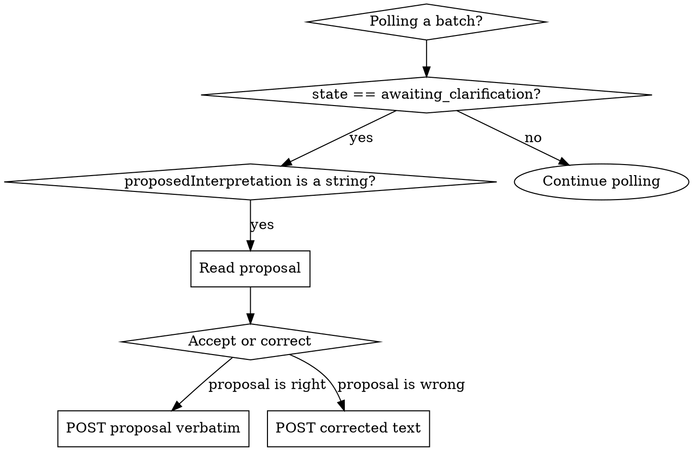

# mma-clarifications

## Overview

When a batch pauses with `state: 'awaiting_clarification'`, the service has proposed an interpretation of an ambiguous task and is waiting for your decision. Read the proposal, then `POST /clarifications/confirm` with either the proposal verbatim (accept) or a corrected version (override). The batch resumes immediately.

**Core principle:** Clarification is a quality gate, not an error. Ambiguous tasks would silently produce the wrong work — the pause forces a deliberate choice.

## When to Use



**Use when:**
- Polling a batch and the terminal envelope has `proposedInterpretation` as a string
- The mma-* skill that dispatched explicitly references this skill in its "if awaiting_clarification" line

**Don't use when:**
- `proposedInterpretation` is `{ kind: 'not_applicable', ... }` → batch isn't waiting; just read `results`
- The batch failed (`error` is a real object) → don't confirm; debug or re-dispatch
- You don't yet have a `batchId` → this skill resumes existing batches, not new ones

## Endpoint

`POST /clarifications/confirm`

Auth required. NOT cwd-gated — operates on a `batchId`.

@include _shared/auth.md

## Request body

```json
{
  "batchId": "550e8400-e29b-41d4-a716-446655440000",
  "interpretation": "Refactor only the auth module, leaving the user module unchanged"
}
```

| Field | Type | Required | Notes |
|---|---|---|---|
| `batchId` | string (UUID) | yes | Batch in `awaiting_clarification` state |
| `interpretation` | string | yes | Accept proposal verbatim, OR provide corrected text the worker should follow instead |

## Response (200)

```json
{ "batchId": "...", "state": "pending" }
```

`state` is usually `pending` (batch resumes). May be `complete` if the executor was already waiting and finishes immediately.

## Full flow

```bash
# 1. Poll until terminal
RESP=$(curl -f --show-error -s -H "Authorization: Bearer $TOKEN" \
  "http://localhost:$PORT/batch/$BATCH_ID")

# 2. Check for a string proposal (not the not_applicable sentinel)
PROPOSAL=$(echo "$RESP" | jq -r 'select(.proposedInterpretation | type == "string") | .proposedInterpretation')

# 3. Confirm — accept proposal verbatim, or supply corrected text
curl -f --show-error -s -X POST \
  -H "Authorization: Bearer $TOKEN" \
  -H "Content-Type: application/json" \
  -d "{\"batchId\":\"$BATCH_ID\",\"interpretation\":\"$PROPOSAL\"}" \
  "http://localhost:$PORT/clarifications/confirm"

# 4. Resume polling for terminal
```

@include _shared/polling.md

## Common pitfalls

❌ **Confirming a wrong proposal verbatim because "the service knows best"**
The service is GUESSING from limited context. If the proposal would do the wrong thing, supply corrected `interpretation` text. **Why:** post-confirmation work is hard to undo.

❌ **Treating the pause as an error**
`awaiting_clarification` is a SUCCESS path — it caught ambiguity before producing wrong work. Read, decide, confirm.

❌ **Forgetting the `batchId` is the original, not a new one**
This endpoint mutates the existing batch — it does not create a new one. **Fix:** poll the SAME `batchId` after confirming.

❌ **Polling without checking `proposedInterpretation`'s shape**
The field is either a `string` (paused) or `{ kind: 'not_applicable' }` (terminal). **Fix:** check the JSON type before treating it as text.

@include _shared/error-handling.md
