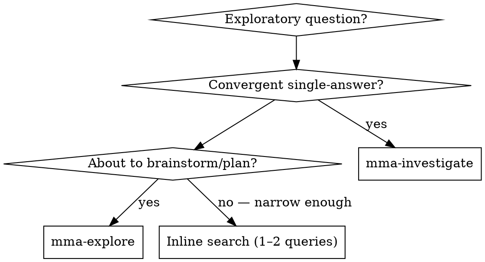

# mma-explore

## Overview

Explore the codebase AND the web in parallel, synthesizing 3–5 distinct directions with cross-thread synthesis. Each direction carries its own citations and a confidence assessment. The worker runs internal (grep/read) and external (web search) searches concurrently; you receive a diverged option set you can weigh and narrow in a downstream brainstorming step.

**Core principle:** Exploration is divergent (survey, enumerate, compare). Synthesis turns raw threads into ranked, citable directions. The main agent stays on judgment — deciding which directions to pursue and what tradeoffs matter.

## When to Use

**First decision — output shape:**
- Want **one** synthesized answer with citations? → use `mma-investigate` (don't continue here)
- Want **multiple** distinct directions to weigh (3–5 threads + cross-thread synthesis)? → continue here

Internal-vs-external is not your decision; explore always runs both.



**Use when:**
- "What are our options for handling auth across microservices?"
- "What approaches exist for real-time sync in this codebase?"
- "Survey how the industry handles schema migration rollbacks"
- You're about to run `superpowers:brainstorming` and need a broad option set
- The question requires both internal codebase knowledge AND external research
- Tradeoff analysis where you need multiple perspectives before committing

**Don't use when:**
- "Where is X called?" or "How does Y work?" → `mma-investigate` (convergent)
- You already know the landscape and just need to choose → go straight to `superpowers:brainstorming`
- The question is about git history → `git log` / `git blame`
- You need to MODIFY code → use `mma-delegate` after exploring + brainstorming
- The scope is narrow enough for 1–2 inline reads/searches → do it yourself

## Endpoint

`POST /explore?cwd=<abs-path>`

@include _shared/auth.md

## Request body

```json
{
  "question": "What are our options for handling auth across microservices?",
  "filePaths": ["/project/src/auth/"],
  "contextBlockIds": []
}
```

| Field | Type | Required | Notes |
|---|---|---|---|
| `question` | string | yes | Natural-language exploratory question. Phrase it broadly — "options for", "approaches to", "how others handle". |
| `filePaths` | string[] | no | Anchor paths the worker starts internal search from. Worker may search beyond. |
| `contextBlockIds` | string[] | no | IDs from `mma-context-blocks` — enables follow-up / delta exploration |
| `tools` | `'none' \| 'readonly'` | no | Default `'readonly'`. `'no-shell'` and `'full'` are rejected — exploration is read-only |

> Worker tier for `mma-explore` is hardcoded to `complex` and is not caller-configurable. Sending `agentType` is rejected with HTTP 400.

**Anchor broad questions with `filePaths`:**

❌ `{ "question": "What are our options for state management?" }` — searches entire repo + web blindly
✅ `{ "question": "What are our options for state management?", "filePaths": ["src/components/", "src/hooks/"] }` — internal search bounded; web search still broad

**Why:** the worker runs both internal and external searches under its cost ceiling. Anchors keep the internal search focused so more budget goes to synthesis.

## Full example

```bash
BATCH=$(curl -f --show-error -s -X POST \
  -H "Authorization: Bearer $TOKEN" \
  -H "Content-Type: application/json" \
  -d '{"question":"What are our options for handling auth across microservices?"}' \
  "http://localhost:$PORT/explore?cwd=/project")
BATCH_ID=$(echo "$BATCH" | jq -r '.batchId')
```

@include _shared/polling.md

@include _shared/response-shape.md

## Per-task report shape

Each task carries an `exploration` field on its per-task report:

```json
{
  "exploration": {
    "threads": [
      {
        "id": "T1",
        "direction": "Centralized auth gateway with JWT propagation",
        "rationale": "Fits existing Node.js infra; team already familiar with JWT",
        "confidence": { "level": "high", "rationale": "Cited from internal auth module + 3 external sources" },
        "citations": [
          { "source": "internal", "file": "src/auth/middleware.ts", "lines": "12-45", "claim": "Existing JWT validation pipeline" },
          { "source": "external", "url": "https://example.com/auth-patterns", "claim": "Gateway pattern is industry standard for polyglot services" }
        ],
        "tradeoffs": ["Adds latency hop per request", "Single point of failure without redundancy"]
      }
    ],
    "synthesis": {
      "summary": "Three broad families: gateway-based, sidecar-based, and library-based. Gateway fits our stack best.",
      "comparativeNotes": "Gateway and sidecar both support polyglot; library is simpler but binds to Node.js.",
      "recommendedStartingPoint": "T1 — gateway-based, because it reuses existing auth middleware."
    },
    "sourcesUsed": {
      "internal": { "filesRead": 12, "grepResults": 45 },
      "external": { "searchesPerformed": 5, "pagesFetched": 8 }
    },
    "diagnostics": {
      "malformedCitationLines": 0,
      "missingRequiredSections": [],
      "invalidRequiredSections": []
    }
  }
}
```

`workerStatus` is one of `done`, `done_with_concerns`, `needs_context`, `blocked`. When `done_with_concerns`, the per-task report carries `incompleteReason` (`turn_cap`, `cost_cap`, `timeout`, or `missing_sections`). When `needs_context`, the worker flagged a `[needs_context]` bullet under `## Unresolved` — re-dispatch with extra context (anchor paths or a context block).

## Reading the findings (3.10.5+)

The terminal envelope's `results[N].annotatedFindings` is a list of structured
findings the reviewer extracted and scored from the explorer's narrative.
Every finding has the same shape:

| Field | Type | Notes |
|---|---|---|
| `id` | string | Reviewer-assigned, e.g. `F1`, `F2`. |
| `severity` | `'critical' \| 'high' \| 'medium' \| 'low'` | 4-tier. |
| `claim` | string | One-sentence summary. |
| `evidence` | string ≥20 chars | Quoted from worker output when grounded. |
| `suggestion?` | string | Optional fix recommendation. |
| `annotatorConfidence` | `number \| null` | 0–100; `null` from deterministic fallback. |
| `evidenceGrounded` | boolean | True iff `evidence` is verbatim from worker output. |

`qualityReviewVerdict` is `'annotated'` (normal), `'skipped'` (kill switch), or `'error'` (reviewer transport failure). See `mma-investigate` SKILL.md for finding-rendering conventions — same shape.

## Best practices

This skill is one step in the larger flow described in `multi-model-agent` → "Best practices". Recipes that involve `mma-explore`:

- **Recipe E — Explore-brainstorm-plan.** `mma-explore` → `superpowers:brainstorming` → write the plan → `mma-execute-plan`. Exploration produces a broad option set; brainstorming evaluates and narrows it; the narrowed direction becomes a plan. Run `/explore` before `superpowers:brainstorming` for divergent ideation — the brainstorm works better when it has multiple concrete directions to compare.

- **Recipe F — Explore-investigate.** Start broad with `mma-explore` to identify promising directions, then use `mma-investigate` to deep-dive a specific thread that emerged. The exploration's `synthesis.recommendedStartingPoint` tells you where to focus the investigation.

Anti-pattern alert: **`inline-research-leakage`** (AP3). If you find yourself running multiple WebSearch + grep calls just to enumerate options, delegate to explore instead. The worker runs internal and external searches in parallel on its cheap budget; you read the synthesis.

## Common pitfalls

❌ **Asking a convergent question**
> question: "Where is the auth middleware defined?"

That's a single-answer codebase question — use `mma-investigate`. Explore is designed for divergent questions that benefit from multiple angles.

❌ **Skipping brainstorming after explore**
Exploration produces threads, not decisions. Always feed the results into `superpowers:brainstorming` (or equivalent planning) before committing to a direction. The exploration is input to judgment, not a substitute for it.

❌ **Expecting exhaustive coverage**
Explore samples the codebase and the web under a cost ceiling. It produces 3–5 representative threads, not an exhaustive survey. If a thread is missing, re-dispatch with tighter `filePaths` anchors or a `contextBlockIds` delta.

❌ **Treating `done_with_concerns` as failure**
The worker still produced threads and a synthesis. Read them — partial coverage with `incompleteReason: 'turn_cap'` often surfaces enough directions to start brainstorming. Re-dispatch with a tighter scope only if the threads are unusable.

❌ **Inline-research instead of delegating**
About to run 3+ WebSearch + grep calls just to enumerate options? That's the wrong tradeoff — the worker searches on its cheap budget; you read its synthesis on yours.

## Terminal context block

Every completed task automatically registers a terminal markdown context block containing the full task report (headline, exploration threads, synthesis, and annotated findings). The `blockId` is returned in each task result as `terminalBlockId`. This block is immutable, lives for the session duration, and counts against the project's `maxEntries` quota (default 500).

Use `terminalBlockId` in downstream `contextBlockIds` to chain findings across the explore → brainstorm → plan workflow without re-inlining content. The block is registered server-side at task completion; no caller action is needed. Delete explicitly via `DELETE /context-blocks/:id` when no longer needed.

@include _shared/error-handling.md
