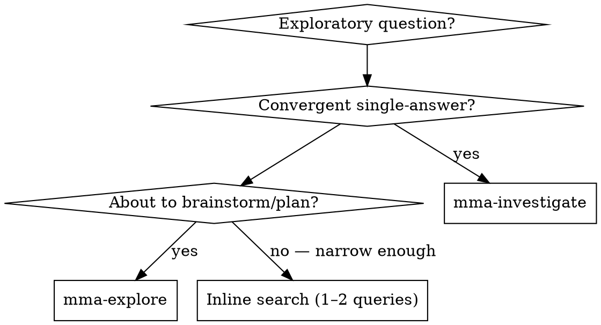

# mma-explore

## Overview

Codebase + external sources, synthesised into 3–5 distinct directions. Two
delegated calls (`mma-investigate` for the internal codebase, `mma-research`
for external sources) run in parallel; **you** synthesise their results into
the final output.

**Core principle:** Exploration is divergent (survey, enumerate, compare).
Synthesis turns raw threads into ranked, citable directions. The internal and
external research is delegated; the synthesis is your judgment work and stays
in main context.

## When to Use

First decision — output shape:
- Want **one** synthesised answer with citations? → use `mma-investigate` (don't continue here)
- Want **multiple** distinct directions to weigh (3–5 threads + cross-thread synthesis)? → continue here

Internal-vs-external is not your decision; explore always runs both.



## How to run

Dispatch BOTH in ONE message (parallel tool use):

1. `mma-investigate` — internal codebase research
   - You MAY skip this only if the question is unambiguously greenfield (no
     codebase touch-points exist). When in doubt, run it.
2. `mma-research` — external multi-source research

Wait for both to return. Do NOT proceed to synthesis until you have both
results (or have decided to skip investigate).

## Endpoint

This is a main-agent skill — there is no dedicated `/explore` HTTP endpoint.
Behind the scenes, you dispatch the two delegated tools `mma-investigate`
(`POST /investigate`) and `mma-research` (`POST /research`) yourself.

## Request body

(Not applicable — this skill orchestrates two other skills.) See
[`mma-investigate`](../mma-investigate/SKILL.md) and
[`mma-research`](../mma-research/SKILL.md) for their request bodies.

## Full example

The main agent (you) issues a single message with two parallel tool calls:

```
[parallel tool use]
  mma-investigate { question: "How does our streaming JSON parser handle backpressure?", filePaths: ["src/parsers/"] }
  mma-research    { researchQuestion: "State-of-the-art streaming JSON parsers with backpressure?", background: "We use a single-pass push parser." }
```

## Per-task report shape

Synthesis output (REQUIRED — your reply MUST contain these):

Produce **3–5 threads**. Each thread MUST have:

- A **title** and **one-paragraph summary**.
- One **internal citation** (from investigate) — `file/path.ts:LINE — claim`.
  - If investigate was skipped or returned no relevant findings, use the
    sentinel `(no internal anchor — fully greenfield)`.
- One **external citation** (from research) — `<source> — claim`.
  - If research returned nothing usable, use the sentinel
    `(no external source found)`.
- A **one-line divergence reason** — what makes this thread different from
  the others. No two threads may share the same divergence axis.

End with `## Recommended next step` — one paragraph naming which thread to
pursue first and why.

## Best practices

This skill is one step in the larger flow described in `multi-model-agent` →
"Best practices". Use this BEFORE `superpowers:brainstorming` when the
brainstorming would otherwise start cold — divergent threads ground the
brainstorming in real code + real prior art.

## Common pitfalls

❌ **Do not dump the two raw reports back to the user.** The synthesis IS the
output; the raw reports are inputs you reason over. **Fix:** synthesise into
3–5 threads with citations from BOTH legs (or sentinels) and a recommended
next step.

❌ **Skipping `mma-investigate` for convenience.** "Greenfield" must be
unambiguous. When in doubt, run it. **Fix:** only skip if the question is
unambiguously greenfield (no codebase touch-points).

❌ **Inventing citations.** Every citation must trace back to one of the two
delegated reports or to a sentinel. **Fix:** if a thread has no usable
citation from a leg, use the sentinel — do not fabricate.

❌ **Padding to hit 5 threads.** ONE thread with high-confidence citations is
better than 5 watery ones. **Fix:** stop at the natural number of distinct
directions in the data.

## Failure handling

| Scenario | What to do |
|---|---|
| `mma-research` failed | Use `(no external source found)` sentinel on every external line. If `mma-investigate` also failed, do NOT synthesise — surface both errors to the user. |
| `mma-investigate` failed | Treat as greenfield — use `(no internal anchor — fully greenfield)` sentinel. |
| Both failed | Report both errors to the user. Do NOT fabricate threads. |
| Investigate returned `needsCallerClarification: true` | Pause — surface the clarification need to the user. Do NOT synthesise over an unfinished investigation. |
| Research returned 0 usable sources | Sentinel on external lines. Add a one-line note in synthesis preamble: *"External research returned no usable sources — threads anchor on internal findings only."* |

See `superpowers:brainstorming` as the natural follow-up — convergent narrowing
on a chosen thread.
