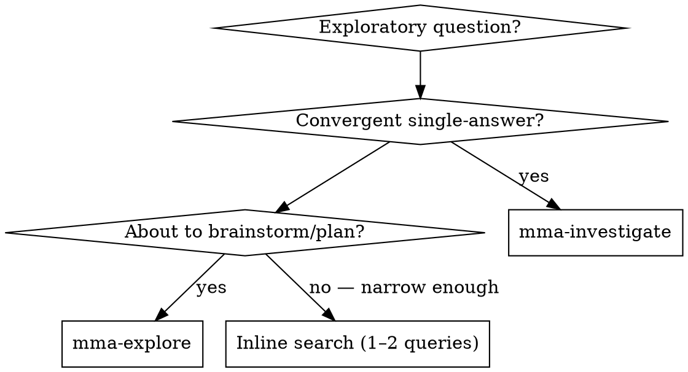

# mma-explore

## Overview

Codebase + external sources + prior learnings, synthesised into 3–5 distinct
directions. Three delegated calls run in parallel — `mma-investigate` (internal
codebase), `mma-research` (external sources), and `mma-journal-recall` (what
this project already learned/decided, from the `.mmagent/journal/` graph) —
and **you** synthesise their results into the final output.

**Core principle:** Exploration is divergent (survey, enumerate, compare).
Synthesis turns raw threads into ranked, citable directions. The three legs
are delegated; the synthesis is your judgment work and stays in main context.
The journal leg is what keeps you from re-proposing a direction the project
already tried and dropped — it grounds the scan in your own history, not just
the code and the outside world.

## When to Use

First decision — output shape:
- Want **one** synthesised answer with citations? → use `mma-investigate` (don't continue here)
- Want **multiple** distinct directions to weigh (3–5 threads + cross-thread synthesis)? → continue here

Internal-vs-external is not your decision; explore always runs both.



## How to run

Dispatch ALL THREE in ONE message (parallel tool use):

1. `mma-investigate` — internal codebase research
   - You MAY skip this only if the question is unambiguously greenfield (no
     codebase touch-points exist). When in doubt, run it.
2. `mma-research` — external multi-source research
3. `mma-journal-recall` — prior learnings/decisions from the project journal
   - Always run it. If the project has no journal yet (or nothing relevant),
     it returns zero findings — a valid result you handle with the
     `(no prior learning)` sentinel. Never skip it to "save a call": a
     superseded prior decision is exactly the signal you most want before
     brainstorming.

Wait for all legs to return. Do NOT proceed to synthesis until you have every
result (or have decided to skip investigate as greenfield).

## Endpoint

This is a main-agent skill — there is no dedicated `/explore` HTTP endpoint.
Behind the scenes, you dispatch the three delegated tools `mma-investigate`
(`POST /investigate`), `mma-research` (`POST /research`), and
`mma-journal-recall` (`POST /journal-recall`) yourself.

## Request body

(Not applicable — this skill orchestrates three other skills.) See
[`mma-investigate`](../mma-investigate/SKILL.md),
[`mma-research`](../mma-research/SKILL.md), and
[`mma-journal-recall`](../mma-journal-recall/SKILL.md) for their request bodies.

## Full example

The main agent (you) issues a single message with three parallel tool calls:

```
[parallel tool use]
  mma-investigate    { question: "How does our streaming JSON parser handle backpressure?", filePaths: ["src/parsers/"] }
  mma-research       { researchQuestion: "State-of-the-art streaming JSON parsers with backpressure?", background: "We use a single-pass push parser." }
  mma-journal-recall { query: "what have we learned about streaming-parser backpressure or buffering tradeoffs?" }
```

## Reading the leg results

All three legs (`mma-investigate`, `mma-research`, `mma-journal-recall`) return the v5 wire envelope (see `mma-investigate/SKILL.md` → "v5 wire shape"). Each sub-task result is a `ComposePayload` with the standard seven fields. The authoritative citation source is **`results[0].findings`** — an array of `{ id, severity, category, claim, evidence, suggestion, source }`.

Explore top-level orchestration aggregates sub-task results into a valid `ImplementPayload` (read-route shape) before the final `annotate` stage runs. Each sub-task follows the same v5 wire shape; the top-level result is a composition of those sub-tasks.

| Check | How |
|---|---|
| Did the leg succeed? | `results[0].completed === true` — findings may be zero on a read route; finding nothing wrong is a valid completion |
| Internal citation source | `results[0].findings[i].claim` plus a `file:LINE` token from `results[0].findings[i].evidence` (workers style them as `` `path:LINE` `` markdown-linked refs) |
| External citation source | `results[0].findings[i].claim` plus a source name / URL from `results[0].findings[i].evidence` |
| Prior-learning source | `results[0].findings[i].claim` plus a journal node id from `results[0].findings[i].evidence` (recall cites `` `.mmagent/journal/nodes/NNNN-…` `` or `node NNNN`). Watch the node's status: a **superseded** learning is a "we tried this and moved on" signal — surface it, don't bury it |
| Divergence axis | `results[0].findings[i].category` groups findings by criterion — pick across categories so threads don't collapse onto one axis |

Apply a sentinel only when `findings` is empty AND `results[0].message` contains no finding-level content — i.e., the worker genuinely returned nothing. Do NOT apply a sentinel just because `results[0].message` reads tersely or `results[0].telemetry.workerSelfAssessment === 'failed'` — a worker can say `'failed'` with usable partial findings.

## Per-task report shape

Synthesis output (REQUIRED — your reply MUST contain these):

Produce **3–5 threads**. Each thread MUST have:

- A **title** and **one-paragraph summary**.
- One **internal citation** (from investigate) — `file/path.ts:LINE — claim`.
  - Pick from `results[0].findings`: take `claim` as the citation claim and pull a `file:LINE` token out of `evidence`.
  - Use the sentinel `(no internal anchor — fully greenfield)` ONLY when investigate was skipped, or `results[0].findings` is empty AND `results[0].message` contains no finding-level content. The top-level `message` alone is not evidence — see "Reading the leg results" above.
- One **external citation** (from research) — `<source> — claim`.
  - Pick from `results[0].findings`: take `claim` as the citation claim and pull a source name / URL out of `evidence`.
  - Use the sentinel `(no external source found)` only when `results[0].findings` is empty for the research leg.
- One **prior-learning citation** (from journal-recall) WHEN a relevant node exists — `(journal) node NNNN — claim`.
  - Pick from the recall leg's `results[0].findings`: take `claim` as the citation and pull the node id out of `evidence`.
  - If the cited node is **superseded**, say so inline (e.g. `(journal) node 0012 [superseded by 0013] — …`) so the thread carries the "we already moved past this" signal.
  - Use the sentinel `(no prior learning)` when the recall leg returned no relevant node — most threads on a young project will use this, and that's fine.
- A **one-line divergence reason** — what makes this thread different from
  the others. No two threads may share the same divergence axis.

If the recall leg surfaced a learning that **invalidates** a direction (a
superseded or dropped decision that maps onto a thread you'd otherwise
propose), do not silently omit it — keep the thread but mark it
`⚠ already explored — see (journal) node NNNN` and weight it down in the
recommendation. Prior learnings prune the search; they don't just decorate it.

End with `## Recommended next step` — one paragraph naming which thread to
pursue first and why. If a prior learning rules a thread in or out, cite it here.

## Best practices

This skill is one step in the larger flow described in `multi-model-agent` →
"Best practices". Use this BEFORE `superpowers:brainstorming` when the
brainstorming would otherwise start cold — divergent threads ground the
brainstorming in real code + real prior art.

## Common pitfalls

❌ **Do not dump the two raw reports back to the user.** The synthesis IS the
output; the raw reports are inputs you reason over. **Fix:** synthesise into
3–5 threads with citations from BOTH legs (or sentinels) and a recommended
next step.

❌ **Skipping `mma-investigate` for convenience.** "Greenfield" must be
unambiguous. When in doubt, run it. **Fix:** only skip if the question is
unambiguously greenfield (no codebase touch-points).

❌ **Inventing citations.** Every citation must trace back to one of the two
delegated reports or to a sentinel. **Fix:** if a thread has no usable
citation from a leg, use the sentinel — do not fabricate.

❌ **Padding to hit 5 threads.** ONE thread with high-confidence citations is
better than 5 watery ones. **Fix:** stop at the natural number of distinct
directions in the data.

## Failure handling

| Scenario | What to do |
|---|---|
| `mma-research` failed | Use `(no external source found)` sentinel on every external line. If `mma-investigate` also failed, do NOT synthesise — surface both errors to the user. |
| `mma-investigate` failed | Treat as greenfield — use `(no internal anchor — fully greenfield)` sentinel. |
| `mma-journal-recall` failed OR returned 0 findings | Use the `(no prior learning)` sentinel on every prior-learning line and continue — the journal leg is additive, never blocking. A young project with an empty journal hits this every time; it is not an error. |
| All three failed | Report all errors to the user. Do NOT fabricate threads. |
| Both investigate and research failed | Report both errors to the user. Do NOT fabricate threads. |
| Investigate returned `needsCallerClarification: true` | Pause — surface the clarification need to the user. Do NOT synthesise over an unfinished investigation. |
| Research returned 0 usable sources | Sentinel on external lines. Add a one-line note in synthesis preamble: *"External research returned no usable sources — threads anchor on internal findings only."* |
| Investigate headline reads "0 citations" / "confidence unparseable" but `results[0].findings.length > 0` | Known stage-sync noise — IGNORE the headline. The leg succeeded; read `results[0].findings` directly. |

See `superpowers:brainstorming` as the natural follow-up — convergent narrowing
on a chosen thread.
