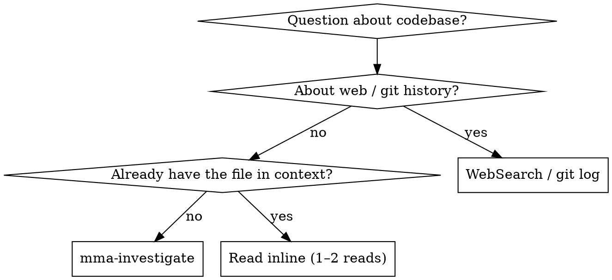

# mma-investigate

## Overview

Answer a codebase question via a read-only mmagent worker. The worker greps and reads on its cheap budget; you read its synthesis on yours.

**Core principle:** Investigation is labor (read, grep, synthesize). Delegate it. The main agent stays on judgment — deciding what the answer means and what to do with it.

## When to Use



**Use when:**
- "How does X work in this codebase?"
- "Where is Y called from?"
- "What does this directory do?"
- The answer requires reading 3+ files or grepping
- Cross-cutting investigations (auth flow across modules, data lineage)

**Don't use when:**
- The answer is in 1–2 files you already have in context → just `Read`
- It's about web docs / external APIs → `WebSearch` / `WebFetch`
- It's about git history → `git log` / `git blame`
- You need to MODIFY code based on the finding → `mma-delegate` (research + edit)

## Endpoint

`POST /investigate?cwd=<abs-path>`

@include _shared/auth.md

## Request body

```json
{
  "question": "How does the auth middleware handle token refresh?",
  "filePaths": ["/project/src/auth/"],
  "contextBlockIds": []
}
```

| Field | Type | Required | Notes |
|---|---|---|---|
| `question` | string | yes | Natural-language investigation question |
| `filePaths` | string[] | no | Anchor paths the worker starts from. Worker may grep beyond. |
| `contextBlockIds` | string[] | no | IDs from `mma-context-blocks` — enables follow-up / delta investigation |
| `agentType` | `'standard' \| 'complex'` | no | Caller override of the route default (`'complex'`) |
| `tools` | `'none' \| 'readonly'` | no | Default `'readonly'`. `'no-shell'` and `'full'` are rejected — investigation is read-only |

**Anchor narrow questions with `filePaths`:**

❌ `{ "question": "Where is parseConfig called?" }` — searches the whole repo
✅ `{ "question": "Where is parseConfig called?", "filePaths": ["src/"] }` — bounded

**Why:** the worker greps and reads under its cost ceiling. Without anchors, broad questions exhaust the budget before they finish.

## Full example

```bash
BATCH=$(curl -f --show-error -s -X POST \
  -H "Authorization: Bearer $TOKEN" \
  -H "Content-Type: application/json" \
  -d '{"question":"How does the auth middleware handle token refresh?"}' \
  "http://localhost:$PORT/investigate?cwd=/project")
BATCH_ID=$(echo "$BATCH" | jq -r '.batchId')
```

@include _shared/polling.md

@include _shared/response-shape.md

## Per-task report shape

Each task carries an `investigation` field on its per-task report:

```json
{
  "investigation": {
    "citations": [
      { "file": "src/auth/refresh.ts", "lines": "45-72", "claim": "Refresh handler reads bearer." }
    ],
    "confidence": { "level": "high", "rationale": "All claims directly cited." },
    "diagnostics": {
      "malformedCitationLines": 0,
      "missingRequiredSections": [],
      "invalidRequiredSections": []
    }
  }
}
```

`workerStatus` is one of `done`, `done_with_concerns`, `needs_context`, `blocked`. When `done_with_concerns`, the per-task report carries `incompleteReason` (`turn_cap`, `cost_cap`, `timeout`, or `missing_sections`). When `needs_context`, the worker flagged a `[needs_context]` bullet under `## Unresolved` — re-dispatch with extra context (anchor paths, a context block, or a clarification turn).

## Best practices

This skill is one step in the larger flow described in `multi-model-agent` → "Best practices". Recipes that involve `mma-investigate`:

- **Recipe C — Investigate-plan-execute.** `mma-investigate` → write the plan → `mma-execute-plan` → `mma-retry`. The investigation produces the synthesis you need to write the plan; the plan becomes a context block for execute-plan.

Anti-pattern alert: **`inline-labor-leakage`** (AP2). If you find yourself reading 3+ files or running any grep in main context, that's the trigger to delegate here instead.

## Common pitfalls

❌ **Asking for a fix instead of an answer**
> question: "Refactor the auth middleware to use JWT"

The investigator can't write — `tools: 'readonly'`. **Fix:** use `mma-delegate` for research-then-edit, or split: investigate first, then dispatch the edit.

❌ **Treating `done_with_concerns` as failure**
The worker still produced citations and a confidence level. Read them — partial coverage with `incompleteReason: 'turn_cap'` often answers the question well enough. Re-dispatch with a tighter scope only if the citations are unusable.

❌ **Inline-reading instead of delegating**
About to `Read` 3+ files just to answer one question? That's the wrong tradeoff — the worker reads on its cheap budget; you read its synthesis on yours.

@include _shared/error-handling.md
