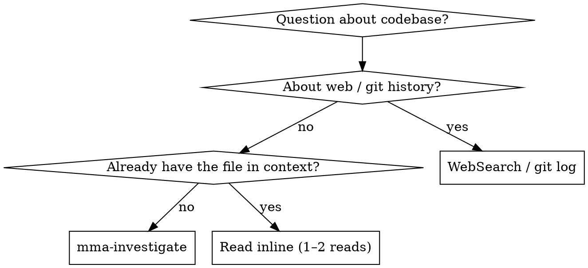

# mma-investigate

## Overview

Answer a codebase question via a read-only mmagent worker. The worker greps and reads on its cheap budget; you read its synthesis on yours.

**Core principle:** Investigation is labor (read, grep, synthesize). Delegate it. The main agent stays on judgment — deciding what the answer means and what to do with it.

## When to Use



**Use when:**
- "How does X work in this codebase?"
- "Where is Y called from?"
- "What does this directory do?"
- The answer requires reading 3+ files or grepping
- Cross-cutting investigations (auth flow across modules, data lineage)

**Don't use when:**
- The answer is in 1–2 files you already have in context → just `Read`
- It's about web docs / external APIs → `WebSearch` / `WebFetch`
- It's about git history → `git log` / `git blame`
- You need to MODIFY code based on the finding → `mma-delegate` (research + edit)
- You want to consider multiple distinct directions, not converge on one answer → `mma-explore` (divergent ideation, codebase + web)

## Endpoint

`POST /investigate?cwd=<abs-path>`

@include _shared/auth.md

## Request body

```json
{
  "question": "How does the auth middleware handle token refresh?",
  "subtype": "default",
  "filePaths": ["/project/src/auth/"],
  "contextBlockIds": []
}
```

| Field | Type | Required | Notes |
|---|---|---|---|
| `question` | string | yes | Natural-language investigation question |
| `subtype` | `'default'` | no (defaults to `'default'`) | Reserved for future criteria sets; only `default` is wired today. |
| `filePaths` | string[] | no | Anchor paths the worker starts from. Worker may grep beyond. |
| `contextBlockIds` | string[] | no | IDs from `mma-context-blocks` — enables follow-up / delta investigation |
| `tools` | `'none' \| 'readonly'` | no | Default `'readonly'`. `'no-shell'` and `'full'` are rejected — investigation is read-only |

> Worker tier for `mma-investigate` is hardcoded to `complex` and is not caller-configurable. Sending `agentType` is rejected with HTTP 400.

**Anchor narrow questions with `filePaths`:**

❌ `{ "question": "Where is parseConfig called?" }` — searches the whole repo
✅ `{ "question": "Where is parseConfig called?", "filePaths": ["src/"] }` — bounded

**Why:** the worker greps and reads under a turn and wall-clock budget. Without anchors, broad questions exhaust those budgets before they finish.

## Full example

```bash
BATCH=$(curl -f --show-error -s -X POST \
  -H "X-MMA-Client: $MMA_CLIENT" \
  -H "X-MMA-Main-Model: $MMA_MAIN_MODEL" \
  -H "Authorization: Bearer $TOKEN" \
  -H "Content-Type: application/json" \
  -d '{"question":"How does the auth middleware handle token refresh?"}' \
  "http://localhost:$PORT/investigate?cwd=/project")
BATCH_ID=$(echo "$BATCH" | jq -r '.batchId')
```

@include _shared/polling.md

@include _shared/response-shape.md

## Per-task report shape

Each task carries an `investigation` field on its per-task report:

```json
{
  "investigation": {
    "citations": [
      { "file": "src/auth/refresh.ts", "lines": "45-72", "claim": "Refresh handler reads bearer." }
    ],
    "confidence": { "level": "high", "rationale": "All claims directly cited." },
    "diagnostics": {
      "malformedCitationLines": 0,
      "missingRequiredSections": [],
      "invalidRequiredSections": []
    }
  }
}
```

The authoritative success signals are `completed`, `message`, and `findings`. See "v5 wire shape" above for the full envelope.

## v5 wire shape (read route)

Every task result is a `ComposePayload` — seven main-agent fields plus a telemetry block.
The main-agent fields are authoritative; the telemetry block is diagnostics.

```json
{
  "completed": true,
  "message": "Investigation complete; 3 files analysed.",
  "findings": [
    {
      "id": "F1",
      "severity": "high",
      "category": "correctness",
      "claim": "The refresh handler reads bearer from Authorization header unconditionally.",
      "evidence": "src/auth/refresh.ts:45-72 — verbatim substring from worker output.",
      "suggestion": "Add a guard to handle missing Authorization header gracefully.",
      "source": "implementer"
    }
  ],
  "summary": "...",
  "filesChanged": [],
  "commitSha": null,
  "blockId": null,
  "telemetry": {
    "totalDurationMs": 1234,
    "totalCostUSD": 0.08,
    "workerSelfAssessment": "done",
    "reviewVerdict": null,
    "commitOutcome": "not_applicable",
    "stopReason": "normal",
    "haltedStage": null,
    "stages": [...]
  }
}
```

### Key fields

| Field | When populated | Notes |
|---|---|---|
| `completed` | always | `true` when at least one criterion succeeded; `false` on annotator transport failure OR unmet annotate preconditions (e.g. non-`done` worker self-assessment on a read route) |
| `message` | always | human-readable summary; names blocking gates or finding IDs on failure |
| `findings` | always | `source: 'implementer'` for investigate; findings are the deliverable on read routes |
| `workerSelfAssessment` | always | `'done'` or `'failed'` — never `done_with_concerns` |
| `blockId` | always `null` | investigate is a task route, not register-context-block |

### No second review

The LLM-judge stage (`annotate`) runs once, after the worker's output. Its preconditions for read-route `completed: true`:

```
gates.implement.outcome === 'advance'
&& gates.implement.payload.workerSelfAssessment === 'done'
&& (criteriaSucceeded.length > 0 || criteriaErrors.length === 0)
```

Findings are the deliverable — a task that surfaces 5 issues is `completed: true`. Finding nothing wrong is also a valid completion.

### `completed: false` — what it means

Only on annotator transport failure. The `message` names the blocking gate. Re-dispatch with tighter `filePaths` if the worker's citations were unusable.

## Best practices

This skill is one step in the larger flow described in `multi-model-agent` → "Best practices". Recipes that involve `mma-investigate`:

- **Recipe C — Investigate-plan-execute.** `mma-investigate` → write the plan → `mma-execute-plan` → `mma-retry`. The investigation produces the synthesis you need to write the plan; the plan becomes a context block for execute-plan.

Anti-pattern alert: **`inline-labor-leakage`** (AP2). If you find yourself reading 3+ files or running any grep in main context, that's the trigger to delegate here instead. Main-context tokens cost ~10× more than worker tokens, and you only need the synthesis, not the raw reads.

## Common pitfalls

❌ **Asking for a fix instead of an answer**
> question: "Refactor the auth middleware to use JWT"

The investigator can't write — `tools: 'readonly'`. **Fix:** use `mma-delegate` for research-then-edit, or split: investigate first, then dispatch the edit.

❌ **Inline-reading instead of delegating**
About to `Read` 3+ files just to answer one question? That's the wrong tradeoff — the worker reads on its cheap budget; you read its synthesis on yours.

## Terminal context block

Every completed **read-route** task (audit / review / debug / investigate / research) auto-registers a reusable terminal context block containing its report (headline + findings). The block id is returned on each per-task result as **`contextBlockId`**. Write routes (delegate / execute-plan / retry) return `contextBlockId: null` — their record is the commit, not a block. This block is immutable, lives for the session duration, and counts against the project's `maxEntries` quota (default 500).

Use it for delta follow-ups — feed prior results' block ids into a later call's `contextBlockIds`, filtering out nulls:

    contextBlockIds: priorResults.map(r => r.contextBlockId).filter((id) => id !== null)

**Use cases:**
- Pass investigation results to a downstream planning step
- Feed codebase findings into `mma-execute-plan` as shared context
- Carry investigation context forward through the investigate → plan → execute chain

The block is registered server-side at task completion; no caller action is needed to create it. Delete it explicitly via `DELETE /context-blocks/:id` when no longer needed, or let it expire on session teardown.

## Outcome semantics

Every task result carries outcome fields that describe the investigation's conclusion status:

| Field | Type | Meaning |
|---|---|---|
| `findingsOutcome` | `'found' \| 'clean' \| 'not_applicable'` | Answers the question: did the investigation produce a substantive result? |
| `findingsOutcomeReason` | `string \| null` | When `findingsOutcome` is set, this explains why (e.g. "No candidate answers found after perspective 5" or "One clear path identified at high confidence"). |
| `outcomeInferred` | `boolean` | `true` if the system inferred the outcome from findings count; `false` if the worker explicitly stated it. |
| `outcomeMalformed` | `boolean` | `true` if the outcome line was malformed and had to be repaired; `false` otherwise. |

### Enum values

- **`found`** — the investigation produced one or more candidate answers (findings) across one or more criteria. This is the success state for a question-answering route.
- **`clean`** — the investigation completed but produced zero findings. This is valid for issue-hunting routes but unusual for `mma-investigate`, where answering a question always produces at least one candidate.
- **`not_applicable`** — the investigation could not proceed (e.g., the question was out of scope, the codebase provided no data to work with, or the request preconditions failed). This is the "no answer possible" state.

### Empty findings ≠ failure

A crucial semantic: **empty findings does NOT mean `completed: false` or a failed task.** The presence or absence of findings is orthogonal to task success. An investigation that searches thoroughly and produces zero candidate answers is a valid `completed: true` outcome; it simply answers the question with "I found no evidence for that in the codebase."

### Per-route legal outcomes

The legal outcomes for this route are: `['found', 'not_applicable']`

- **`found`** — one or more candidate answers surfaced via the investigation criteria.
- **`not_applicable`** — the question was out of scope, unanswerable, or the codebase provided insufficient data.

The outcome `clean` (zero findings + success) is not legal for `mma-investigate` because an investigation answer is always produced in the `found` state or the task is `not_applicable`.

@include _shared/error-handling.md
