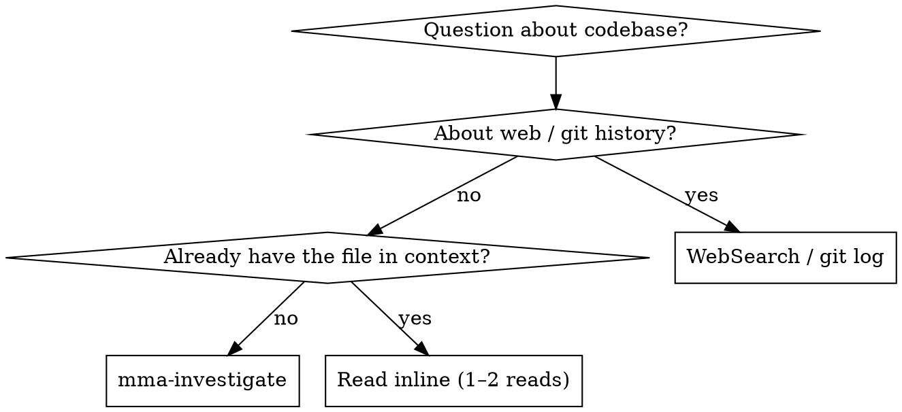

# mma-investigate

## Overview

Answer a codebase question via a read-only mma worker. The worker greps and reads on its cheap budget; you read its synthesis on yours.

**Core principle:** Investigation is labor (read, grep, synthesize). Delegate it. The main agent stays on judgment — deciding what the answer means and what to do with it.

## When to Use



**Use when:**
- "How does X work in this codebase?"
- "Where is Y called from?"
- "What does this directory do?"
- The answer requires reading 3+ files or grepping
- Cross-cutting investigations (auth flow across modules, data lineage)

**Don't use when:**
- The answer is in 1–2 files you already have in context → just `Read`
- It's about web docs / external APIs → `WebSearch` / `WebFetch`
- It's about git history → `git log` / `git blame`
- You need to MODIFY code based on the finding → `mma-delegate` (research + edit)
- You want to consider multiple distinct directions, not converge on one answer → `mma-explore` (divergent ideation, codebase + web)

## Endpoint

`POST /task?cwd=<abs-path>`

@include _shared/auth.md

## Request body

```json
{
  "type": "investigate",
  "prompt": "How does the auth middleware handle token refresh?",
  "target": { "paths": ["/project/src/auth/"] },
  "contextBlockIds": []
}
```

| Field | Type | Required | Notes |
|---|---|---|---|
| `prompt` | string | yes | Natural-language investigation question (min 1 char) |
| `target.paths` | string[] | no | Anchor paths the worker starts from. Worker may grep beyond. |
| `contextBlockIds` | string[] | no | IDs from `mma-context-blocks` (max 2) — enables follow-up / delta investigation |

> Worker tier defaults to `complex`. Send `agentTier` to override if needed.

**Anchor narrow questions with `target.paths`:**

❌ `{ "prompt": "Where is parseConfig called?" }` — searches the whole repo
✅ `{ "prompt": "Where is parseConfig called?", "target": { "paths": ["src/"] } }` — bounded

**Why:** the worker greps and reads under a turn and wall-clock budget. Without anchors, broad questions exhaust those budgets before they finish.

## Full example

```bash
RESULT=$(curl -f --show-error -s -X POST \
  -H "X-MMA-Client: $MMA_CLIENT" \
  -H "X-MMA-Main-Model: $MMA_MAIN_MODEL" \
  -H "Authorization: Bearer $TOKEN" \
  -H "Content-Type: application/json" \
  -d '{"type":"investigate","prompt":"How does the auth middleware handle token refresh?"}' \
  "http://localhost:$PORT/task?cwd=/project")
TASK_ID=$(echo "$RESULT" | jq -r '.taskId')
```

@include _shared/polling.md

@include _shared/response-shape.md

## Best practices

This skill is one step in the larger flow described in `multi-model-agent` → "Best practices". Recipes that involve `mma-investigate`:

- **Recipe C — Investigate-plan-execute.** `mma-investigate` → write the plan → `mma-execute-plan` → `mma-retry`. The investigation produces the synthesis you need to write the plan; the plan becomes a context block for execute-plan.

Anti-pattern alert: **`inline-labor-leakage`** (AP2). If you find yourself reading 3+ files or running any grep in main context, that's the trigger to delegate here instead. Main-context tokens cost ~10× more than worker tokens, and you only need the synthesis, not the raw reads.

## Common pitfalls

❌ **Asking for a fix instead of an answer**
> prompt: "Refactor the auth middleware to use JWT"

The investigator can't write — `tools: 'readonly'`. **Fix:** use `mma-delegate` for research-then-edit, or split: investigate first, then dispatch the edit.

❌ **Inline-reading instead of delegating**
About to `Read` 3+ files just to answer one question? That's the wrong tradeoff — the worker reads on its cheap budget; you read its synthesis on yours.

## Terminal context block

Every completed **read-route** task (audit / review / debug / investigate / research) auto-registers a reusable terminal context block containing its report (headline + findings). The block id is returned on the result as **`contextBlockId`**. Write routes (delegate / execute-plan / retry) return `contextBlockId: null` — their record is the commit, not a block. This block is immutable, lives for the session duration, and counts against the project's `maxEntries` quota (default 500).

Use it for delta follow-ups — feed prior results' block ids into a later call's `contextBlockIds`, filtering out nulls:

    contextBlockIds: priorResults.map(r => r.contextBlockId).filter((id) => id !== null)

**Use cases:**
- Pass investigation results to a downstream planning step
- Feed codebase findings into `mma-execute-plan` as shared context
- Carry investigation context forward through the investigate → plan → execute chain

The block is registered server-side at task completion; no caller action is needed to create it. Delete it explicitly via `DELETE /context-blocks/:id` when no longer needed, or let it expire on session teardown.

## Outcome semantics

**Success vs failure:** Check `error` in the terminal envelope. `error === null` means the task succeeded — read `output.summary`. `error !== null` (with `code` + `message`) means it failed.

**Empty findings is not a failure.** An investigation that finds nothing is a success — it answers "I found no evidence for that in the codebase." Check `output.summary.findings.length === 0`. The `output.summary.answer` field contains the narrative answer.

@include _shared/error-handling.md
