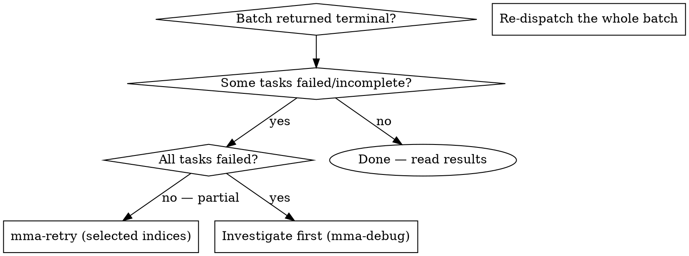

# mma-retry

## Overview

Re-run selected tasks from a completed or failed batch. Specify the original `batchId` and the zero-based indices of the tasks to re-run. The retry runs those tasks fresh with the same configuration as the original batch and produces a new `batchId`.

**Core principle:** A batch is the unit of dispatch, but a TASK is the unit of failure. Retry at the task level so successful tasks aren't re-charged.

## When to Use



**Use when:**
- A previous batch's terminal envelope shows mixed `done` / `done_with_concerns` / `failed`
- 1–N tasks (but not all) need a re-run with the same config
- You want to keep the original batch's diagnostics intact for comparison

**Don't use when:**
- All tasks failed → investigate the systemic cause first (`mma-debug`); retrying won't help
- The original batch is `expired` (TTL elapsed) → re-dispatch fresh
- You want to change the prompt → re-dispatch with the new prompt; retry preserves the original

## Endpoint

`POST /retry?cwd=<abs-path>`

@include _shared/auth.md

## Request body

```json
{
  "batchId": "550e8400-e29b-41d4-a716-446655440000",
  "taskIndices": [1, 3]
}
```

| Field | Type | Required | Notes |
|---|---|---|---|
| `batchId` | string (UUID) | yes | Batch ID from a previous dispatch (not yet expired) |
| `taskIndices` | number[] | yes | Zero-based indices to re-run; must be non-negative integers |

To re-run all tasks: pass `[0, 1, ..., tasks.length - 1]`. (But consider: if all failed, debug instead of retrying.)

## Full example

```bash
# Original batch had 4 tasks; re-run tasks at index 1 and 3
BATCH=$(curl -f --show-error -s -X POST \
  -H "Authorization: Bearer $TOKEN" \
  -H "Content-Type: application/json" \
  -d '{"batchId":"550e8400-e29b-41d4-a716-446655440000","taskIndices":[1,3]}' \
  "http://localhost:$PORT/retry?cwd=/project")
BATCH_ID=$(echo "$BATCH" | jq -r '.batchId')   # NEW batchId — not the original
```

@include _shared/polling.md

@include _shared/response-shape.md

## Best practices

This skill is one step in the larger flow described in `multi-model-agent` → "Best practices". Recipes that involve `mma-retry`:

- **Recipe C — Investigate-plan-execute (last step).** After `mma-execute-plan` returns mixed results, retry the failed indices to close the loop.
- **Recipe D — Plan-execute-retry.** Pass the **original `batchId`** as input, specify the failed indices, keep the same configuration. `mma-retry` produces a NEW `batchId` in its response — poll that one for terminal state. Any `contextBlockIds` from the original carry forward.

Anti-pattern alert: **`full-batch-redispatch`** (AP4). Re-dispatching the entire batch re-charges every successful task. Always retry by index.

## Common pitfalls

❌ **Retrying after the batch expired**
TTL elapsed → original task specs are gone. **Fix:** re-dispatch fresh; the retry endpoint returns 404.

❌ **Retrying without addressing the root cause**
A flaky task that failed once will likely fail again. **Fix:** investigate (`mma-debug` or read the original `result.error.message`), then retry — or escalate `agentType` to `complex` by re-dispatching.

❌ **Confusing the new and original `batchId`**
Retry produces a NEW batchId; polling the original returns the old terminal state. **Fix:** save the retry's `batchId` and poll that one.

❌ **Using retry to change task config**
Retry preserves the ORIGINAL config (prompt, agentType, filePaths, reviewPolicy). **Fix:** if you want different config, re-dispatch with `mma-delegate` / `mma-execute-plan`.

@include _shared/error-handling.md
