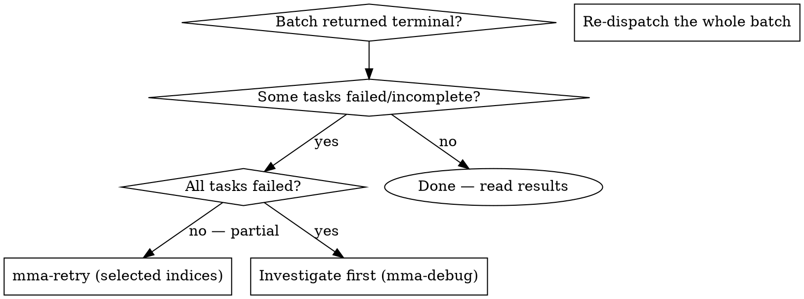

# mma-retry

## Overview

Re-run selected tasks from a completed or failed batch. Specify the original `batchId` and the zero-based indices of the tasks to re-run. The retry runs those tasks fresh with the same configuration as the original batch and produces a new `batchId`.

**Core principle:** A batch is the unit of dispatch, but a TASK is the unit of failure. Retry at the task level so successful tasks aren't re-charged.

## When to Use



**Use when:**
- A previous batch's terminal envelope shows mixed `completed: true` / `completed: false`
- 1–N tasks (but not all) need a re-run with the same config
- You want to keep the original batch's diagnostics intact for comparison

**Don't use when:**
- All tasks failed → investigate the systemic cause first (`mma-debug`); retrying won't help
- The original batch is `expired` (TTL elapsed) → re-dispatch fresh
- You want to change the prompt → re-dispatch with the new prompt; retry preserves the original

## Endpoint

`POST /task?cwd=<abs-path>`

@include _shared/auth.md

## Request body

```json
{
  "type": "retry_tasks",
  "batchId": "550e8400-e29b-41d4-a716-446655440000",
  "taskIndices": [1, 3]
}
```

| Field | Type | Required | Notes |
|---|---|---|---|
| `batchId` | string (UUID) | yes | Batch ID from a previous dispatch (not yet expired) |
| `taskIndices` | number[] | yes | Zero-based indices to re-run; must be non-negative integers |

To re-run all tasks: pass `[0, 1, ..., tasks.length - 1]`. (But consider: if all failed, debug instead of retrying.)

## Full example

```bash
# Original batch had 4 tasks; re-run tasks at index 1 and 3
BATCH=$(curl -f --show-error -s -X POST \
  -H "X-MMA-Client: $MMA_CLIENT" \
  -H "X-MMA-Main-Model: $MMA_MAIN_MODEL" \
  -H "Authorization: Bearer $TOKEN" \
  -H "Content-Type: application/json" \
  -d '{"type":"retry_tasks","batchId":"550e8400-e29b-41d4-a716-446655440000","taskIndices":[1,3]}' \
  "http://localhost:$PORT/task?cwd=/project")
BATCH_ID=$(echo "$BATCH" | jq -r '.batchId')   # NEW batchId — not the original
```

@include _shared/polling.md

## Response shapes

### POST /task?cwd=<abs> — dispatch response (202)

```json
{ "batchId": "<uuid>", "statusUrl": "/batch/<uuid>" }
```

Use `batchId` to poll. `statusUrl` is a convenience pointer. **This is a new batchId** — polling the original batch returns its terminal state.

### GET /batch/:id — polling response

The HTTP status is the state discriminator:

| Status | Meaning |
|---|---|
| `202 text/plain` | Still pending — body is the running headline string |
| `200 application/json` | Terminal — body is the batch envelope below |
| `404` / `401` / `5xx` | Error — see Error response below; stop polling |

### GET /batch/:id?taskIndex=N — single task slice

Same envelope. `results` contains exactly the task at index `N`. Returns `404 unknown_task_index` if `N` is out of range.

### Reading the task result

Each task result is the per-task wire object (`ComposePayload`):

```json
{
  "completed": true,
  "message": "Task completed; tests passed; one file changed.",
  "findings": [
    {
      "id": "F1",
      "severity": "high",
      "category": "correctness",
      "claim": "The function does not handle empty input",
      "evidence": "function foo() { ... } // no null check",
      "suggestion": "Add an explicit null guard at the top",
      "source": "reviewer"
    }
  ],
  "summary": "Refactored utils.ts — removed 3 dead branches, added JSDoc",
  "filesChanged": ["/project/src/utils.ts"],
  "commitSha": "abc123def",
  "blockId": null,
  "telemetry": {
    "totalDurationMs": 12400,
    "totalCostUSD": 0.08,
    "workerSelfAssessment": "done",
    "reviewVerdict": "approved",
    "commitOutcome": "committed",
    "stopReason": "normal",
    "haltedStage": null,
    "stages": [
      { "name": "prepare",        "outcome": "advance", "durationMs": 2,    "costUSD": 0 },
      { "name": "register-block", "outcome": "skip",    "comment": "register-block does not apply to route=delegate", "durationMs": 0, "costUSD": 0 },
      { "name": "implement",      "outcome": "advance", "durationMs": 8900, "costUSD": 0.05 },
      { "name": "review",         "outcome": "advance", "durationMs": 2100, "costUSD": 0.02 },
      { "name": "rework",         "outcome": "skip",    "comment": "rework skipped because review approved", "durationMs": 0, "costUSD": 0 },
      { "name": "commit",         "outcome": "advance", "durationMs": 340,  "costUSD": 0 },
      { "name": "annotate",       "outcome": "advance", "durationMs": 890,  "costUSD": 0.01 },
      { "name": "compose",        "outcome": "advance", "durationMs": 68,   "costUSD": 0 },
      { "name": "terminal",       "outcome": "advance", "durationMs": 100,  "costUSD": 0 }
    ]
  }
}
```

**Top-level fields to read for the main-agent verdict:**

| Field | When `true` / populated |
|---|---|
| `completed: true` | Task succeeded. `message` is the summary; `findings` are post-review issues (if any). |
| `completed: false` | Task did not complete. `message` names the blocking gate or finding; `findings` carry any discovered issues. |
| `findings` | Issues surfaced by the worker or reviewer. `severity` = `critical` \| `high` \| `medium` \| `low`. `source` = `implementer` \| `reviewer`. |
| `filesChanged` | File paths modified (empty for read-only routes). |
| `commitSha` | Git SHA of the committed diff; `null` for read-only routes or when commit was skipped. |
| `blockId` | Always `null` (retry replays write tasks; `contextBlockId` is `null` too — no terminal block). |

**The stages array** (always 9 rows) is the canonical telemetry log. `outcome` is one of:
- `advance` — stage ran and produced its payload
- `skip` — stage did not run; `comment` explains why
- `halt` — stage stopped the chain; `comment` is the failure message
- `not_run` — stage was not reached because a prior stage halted

Use `telemetry.haltedStage` to find the first halt; `telemetry.stopReason` to find why.

### Error response (4xx / 5xx)

```json
{
  "error": "<code>",
  "message": "<human-readable>",
  "details": { /* optional structured context, e.g. fieldErrors for 400 */ }
}
```

`details` is optional and present only when the server has structured additional context.

## Best practices

This skill is one step in the larger flow described in `multi-model-agent` → "Best practices". Recipes that involve `mma-retry`:

- **Recipe C — Investigate-plan-execute (last step).** After `mma-execute-plan` returns mixed results, retry the failed indices to close the loop.
- **Recipe D — Plan-execute-retry.** Pass the **original `batchId`** as input, specify the failed indices, keep the same configuration. `mma-retry` produces a NEW `batchId` in its response — poll that one for terminal state. Any `contextBlockIds` from the original carry forward.

Anti-pattern alert: **`full-batch-redispatch`** (AP4). Re-dispatching the entire batch re-charges every successful task. Always retry by index.

## Common pitfalls

❌ **Retrying after the batch expired**
TTL elapsed → original task specs are gone. **Fix:** re-dispatch fresh; the retry endpoint returns 404.

❌ **Retrying without addressing the root cause**
A flaky task that failed once will likely fail again. **Fix:** investigate (`mma-debug` or read the original `result.error.message`), then retry — or escalate `agentType` to `complex` by re-dispatching.

❌ **Confusing the new and original `batchId`**
Retry produces a NEW batchId; polling the original returns the old terminal state. **Fix:** save the retry's `batchId` and poll that one.

❌ **Using retry to change task config**
Retry preserves the ORIGINAL config (prompt, agentType, filePaths, reviewPolicy). **Fix:** if you want different config, re-dispatch with `mma-delegate` / `mma-execute-plan`.

## Terminal context block

Write-route tasks (delegate / execute-plan / retry) do NOT register a terminal context block — their durable record is the commit (`commitSha` + changed files). The per-task result's `contextBlockId` is always `null` for these routes. Read routes (audit / review / debug / investigate / research) return a non-null `contextBlockId`; see those skills for the delta-follow-up recipe.

Note: a re-run **read-route** task registers its own terminal context block (`contextBlockId`); re-run write tasks register none. Original-batch blocks remain intact and are not overwritten.

@include _shared/error-handling.md
