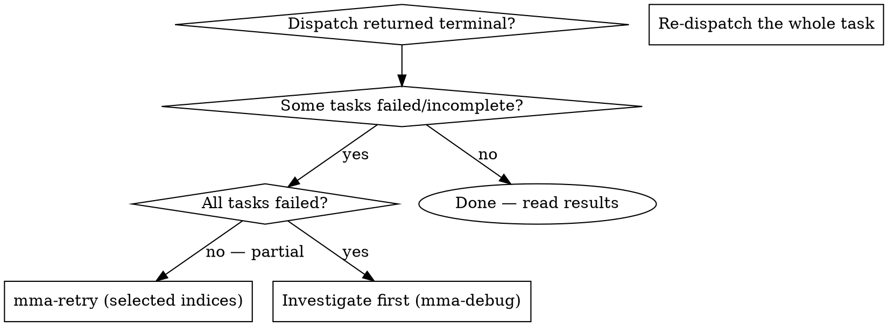

# mma-retry

## Overview

Re-run selected tasks from a completed or failed dispatch. Specify the original `taskId` and the zero-based indices of the tasks to re-run. The retry runs those tasks fresh with the same configuration as the original dispatch and produces a new `taskId`.

**Core principle:** A dispatch is the unit of fan-out, but a TASK is the unit of failure. Retry at the task level so successful tasks aren't re-charged.

## When to Use



**Use when:**
- A previous dispatch's terminal envelope shows mixed task statuses (some done, some failed)
- 1–N tasks (but not all) need a re-run with the same config
- You want to keep the original dispatch's diagnostics intact for comparison

**Don't use when:**
- All tasks failed → investigate the systemic cause first (`mma-debug`); retrying won't help
- The original task is `expired` (TTL elapsed) → re-dispatch fresh
- You want to change the prompt → re-dispatch with the new prompt; retry preserves the original

## Endpoint

`POST /task?cwd=<abs-path>`

@include _shared/auth.md

## Request body

```json
{
  "type": "retry_tasks",
  "taskId": "550e8400-e29b-41d4-a716-446655440000",
  "taskIndices": [1, 3]
}
```

| Field | Type | Required | Notes |
|---|---|---|---|
| `taskId` | string (UUID) | yes | Task ID from a previous dispatch (not yet expired) |
| `taskIndices` | number[] | yes | Zero-based indices to re-run; must be non-negative integers |

To re-run all tasks: pass `[0, 1, ..., tasks.length - 1]`. (But consider: if all failed, debug instead of retrying.)

## Full example

```bash
# Original dispatch had 4 tasks; re-run tasks at index 1 and 3
RESULT=$(curl -f --show-error -s -X POST \
  -H "X-MMA-Client: $MMA_CLIENT" \
  -H "X-MMA-Main-Model: $MMA_MAIN_MODEL" \
  -H "Authorization: Bearer $TOKEN" \
  -H "Content-Type: application/json" \
  -d '{"type":"retry_tasks","taskId":"550e8400-e29b-41d4-a716-446655440000","taskIndices":[1,3]}' \
  "http://localhost:$PORT/task?cwd=/project")
TASK_ID=$(echo "$RESULT" | jq -r '.taskId')   # NEW taskId — not the original
```

@include _shared/polling.md

## Response shapes

### POST /task?cwd=<abs> — dispatch response (202)

```json
{ "taskId": "<uuid>", "statusUrl": "/task/<uuid>" }
```

Use `taskId` to poll. `statusUrl` is a convenience pointer. **This is a new taskId** — polling the original task returns its terminal state.

### GET /task/:taskId — polling response

The HTTP status is the state discriminator:

| Status | Meaning |
|---|---|
| `202 application/json` | Still pending — body is structured progress JSON: `{ taskId, status, phase, elapsedMs, phaseElapsedMs, startedAt }` |
| `200 application/json` | Terminal — body is the task envelope below |
| `404` / `401` / `5xx` | Error — see Error response below; stop polling |

### Error response (4xx / 5xx)

```json
{
  "error": "<code>",
  "message": "<human-readable>",
  "details": { /* optional structured context, e.g. fieldErrors for 400 */ }
}
```

`details` is optional and present only when the server has structured additional context.

## Best practices

This skill is one step in the larger flow described in `multi-model-agent` → "Best practices". Recipes that involve `mma-retry`:

- **Recipe C — Investigate-plan-execute (last step).** After `mma-execute-plan` returns mixed results, retry the failed indices to close the loop.
- **Recipe D — Plan-execute-retry.** Pass the **original `taskId`** as input, specify the failed indices, keep the same configuration. `mma-retry` produces a NEW `taskId` in its response — poll that one for terminal state. Any `contextBlockIds` from the original carry forward.

Anti-pattern alert: **`full-batch-redispatch`** (AP4). Re-dispatching the entire task re-charges every successful sub-task. Always retry by index.

## Common pitfalls

❌ **Retrying after the task expired**
TTL elapsed → original task specs are gone. **Fix:** re-dispatch fresh; the retry endpoint returns 404.

❌ **Retrying without addressing the root cause**
A flaky task that failed once will likely fail again. **Fix:** investigate (`mma-debug` or read the original `result.error.message`), then retry — or escalate `agentTier` to `complex` by re-dispatching.

❌ **Confusing the new and original `taskId`**
Retry produces a NEW taskId; polling the original returns the old terminal state. **Fix:** save the retry's `taskId` and poll that one.

❌ **Using retry to change task config**
Retry preserves the ORIGINAL config (prompt, target, reviewPolicy). **Fix:** if you want different config, re-dispatch with `mma-delegate` / `mma-execute-plan`.

## Terminal context block

Write-route tasks (delegate / execute-plan / retry) do NOT register a terminal context block — their durable record is the commit (merged worktree branch + `output.filesChanged`). The result's `contextBlockId` is always `null` for these routes. Read routes (audit / review / debug / investigate / research) return a non-null `contextBlockId`; see those skills for the delta-follow-up recipe.

Note: a re-run **read-route** task registers its own terminal context block (`contextBlockId`); re-run write tasks register none. Original-task blocks remain intact and are not overwritten.

@include _shared/error-handling.md
