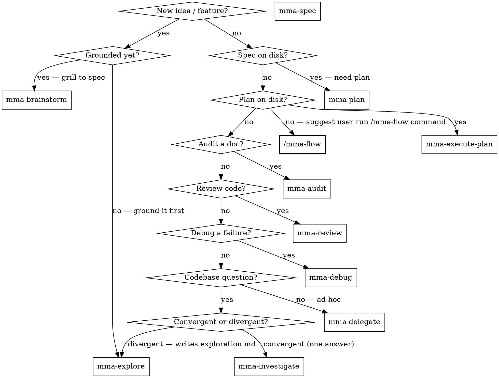

# multi-model-agent (router)

## Overview

Local HTTP service that fans out tool-using work to workers on different LLM providers (Claude, OpenAI-compatible, Codex). Workers run on cheap models; the main agent stays on judgment.

**Core principle:** Pick the most specific `mma-*` skill that fits the task. Specificity reduces input — specialized skills know their route, schema, and defaults so you write less.

## Skill map



| Skill | Purpose |
|---|---|
| `mma-explore` | Braindump → fan out investigate + research + recall in parallel → synthesise → write `exploration.md` (Background · Current State · Rough Direction). Divergent grounding before brainstorm/plan. |
| `mma-brainstorm` | Relentless requirement interview — name the destination → grill the 8 spec components → confirmed decisions → dispatch `mma-spec` |
| `/mma-flow` | **Command (Claude Code only)** — Packaged end-to-end SDLC playbook invoked via `/mma-flow`. Locate → explore → brainstorm → spec → audits → branch → execute → review → verify → PR → merge. Handles both **single-project** repos and **multi-repo** products (parent workspace detected from git-bearing child directories). |
| `/mma-breakout` | **Command (Claude Code only)** — Packaged interactive expert-persona breakout invoked via `/mma-breakout`. Spawns a named teammate, keeps the deep dialogue in direct `@name` conversation, then closes with one confirmed journal batch |
| `mma-spec` | Write a formal spec from structured design decisions (dispatches to `spec` task type) |
| `mma-plan` | Write a TDD implementation plan from a spec file (dispatches to `plan` task type) |
| `mma-execute-plan` | Implement tasks from a plan file (descriptors match plan headings) |
| `mma-audit` | Audit a document/spec/config for security, correctness, style, or performance |
| `mma-review` | Review code for quality, security, performance, correctness. Pass acceptance checklists in the brief if you need verification-style checks. |
| `mma-debug` | Debug a failure with a structured hypothesis |
| `mma-investigate` | Codebase Q&A — structured answer with `file:line` citations + confidence |
| `mma-delegate` | Ad-hoc implementation / research with no plan file |
| `mma-context-blocks` | Register a reused doc once; reference by ID across N tasks |

## Best practices

### The unifying principle

The main session is for judgment, orchestration, and dialogue with the engineer. Everything else — read, grep, audit, review, debug, implement — gets delegated. If you're about to do labor in main context, you've already taken the wrong turn.

### Judgment vs labor — what NEVER delegates

Labor handles work whose answer is findable from the inputs. Main session keeps work whose answer is **judgment** — there is no "right answer" a worker could discover:

- **Brainstorming** — exploring the problem space with the engineer before a spec exists.
- **Spec writing** — deciding what to build, what success looks like, what's out of scope.
- **Plan writing** — turning a spec into ordered, testable steps with the right decomposition.
- **Architecture and design decisions** — choosing the shape of the solution.
- **Final approval / merge decisions** — what ships.
- **Dialogue with the engineer** — clarifying intent, negotiating tradeoffs, answering "should we?".

The test: *if a worker can produce the answer from the given inputs, delegate; if the answer requires deciding what the inputs should be, it's main-session work.* Recipes A–C all keep these judgment steps in main context (e.g., Recipe C explicitly: `mma-investigate` → **write the plan (main)** → `mma-execute-plan`).

### C1 — Delegate by default, inline by exception

If a task needs 3+ file reads or any grep, it goes to a worker. Inline `Read` is reserved for files already in context, single-file lookups, or 1-2 file reads with a known target.

### C2 — Parallel for independence, sequential for iteration

Independent fan-out (5 unrelated audits, 5 unrelated bugs) → multiple dispatches. Coupled rounds where round N's fix produces round N+1's input (audit → fix → re-audit, debug → fix → verify) → sequential.

### C3 — Shared content lives in a context block, not in caller tokens

Any artifact (spec, plan, prior-round findings, long error log) that crosses 2+ calls gets registered once via `mma-context-blocks` and referenced by ID.

### Recipe A — Audit-iterate-clean

`mma-audit` → read findings → fix (inline if 1-2 lines, else `mma-delegate`) → `mma-audit` again. Sequential rounds, NOT parallel re-audits. The fix produces new edges; round 2 catches what round 1 couldn't see. Register the doc as a context block before round 1; reuse the same ID across all rounds. The same shape applies to `mma-review` for source code (review → fix → re-review).

### Recipe B — Debug-fix-review

`mma-debug` (read/reproduce/trace) → `mma-delegate` (apply the fix the hypothesis implies) → `mma-review` with the acceptance criteria included in the brief. Three skills, strict order. Register the failing test output / reproduction log as a context block before the debug call; reuse it on the review call so the reviewer can compare against the same evidence.

### Recipe C — Investigate-plan-execute

`mma-investigate` (codebase Q&A) → write the plan (main-context judgment task) → `mma-execute-plan` (workers implement against named plan headings). Register the plan file as a context block before execute-plan so it isn't re-inlined into every worker's prompt.

### Anti-patterns

1. **`parallel-rounds-same-target`** — Caller fans out 3 parallel calls of the same skill on the same target — `mma-audit` on one document, or `mma-review` on the same source file. The reports overlap heavily; later rounds never see the fix from earlier rounds, so they re-flag the same issues. Corrective: sequential rounds with a fix between each (Recipe A).

2. **`inline-labor-leakage`** — Caller does 3+ `Read` calls, or any `grep`, in main context "just to understand the situation." Main tokens get burned on labor; the answer the caller actually needs is one paragraph of synthesis. Corrective: `mma-investigate` for codebase Q&A; if the goal is implementation, jump straight to `mma-delegate` with file paths and let the worker read.

3. **`re-inlined-shared-content`** — Caller pastes the same spec / plan / error log into 5 separate task dispatches (or across rounds). Token cost scales linearly with N. Corrective: `mma-context-blocks` register once, pass `contextBlockIds` to every task. C3 fires the moment the same content is referenced a second time.

4. **`full-batch-redispatch`** — Caller re-runs `mma-execute-plan` with the entire task list when only 2 of 8 tasks failed. The 6 successful tasks get re-charged. Corrective: dispatch a fresh `mma-execute-plan` scoped to ONLY the failed task headings (pass just those in `tasks[]`), so the successful tasks aren't re-run.

When the user wants the packaged full SDLC route rather than one isolated worker step, suggest they run `/mma-flow` (a Claude Code command installed to `~/.claude/commands/mma-flow.md`). It is the packaged path from design through PR creation and conditional merge, while the other `mma-*` skills remain the underlying primitives used inside that flow. `/mma-flow` is Claude Code only — other clients use the individual skills directly.

When the user needs a bounded interactive expert-persona breakout without polluting the main thread, suggest `/mma-breakout` (a Claude Code command installed to `~/.claude/commands/mma-breakout.md`). It spawns a named breakout teammate, keeps the deep dialogue in direct `@name` conversation isolated from the main context, then closes with one confirmed journal batch instead of adding a backend task type. `/mma-breakout` is Claude Code only.

## Preflight: auto-start the daemon if it is not running

```bash
PORT=7337
if ! curl -sf "http://127.0.0.1:$PORT/health" >/dev/null 2>&1; then
  mma serve >/dev/null 2>&1 & disown
  for _ in 1 2 3 4 5 6 7 8 9 10; do
    sleep 0.5
    curl -sf "http://127.0.0.1:$PORT/health" >/dev/null 2>&1 && break
  done
fi
```

Idempotent: already-running daemon → curl succeeds → no-op. Background `mma serve` (with `& disown`) — never run it foreground (it would block the rest of the script).

## Auth token

```bash
export MMA_AUTH_TOKEN=$(mma print-token)
```

Every request requires `Authorization: Bearer $MMA_AUTH_TOKEN`. The token is generated once on first `mma serve` and persists at `~/.mma/auth-token`. It only changes if the file is manually deleted.

## Worker tier: `agentTier`

All routes accept `agentTier: "standard" | "complex" | "main"` to override the default tier. `mma-delegate` defaults to `"standard"` (cheaper, faster). Pick `"complex"` when:

- The task touches many files or requires multi-step reasoning a standard-tier model cannot hold in context.
- A prior standard run came back with `filesWritten: 0` or `incompleteReason: "turn_cap"` / `"timeout"`.
- The task is security-sensitive or ambiguous enough that being wrong is costly.

Every route has a default tier that can be overridden by sending `agentTier`:

| Route | Default tier |
|---|---|
| `delegate` | `standard` |
| `execute_plan` | `standard` |
| `audit` | `complex` |
| `review` | `complex` |
| `debug` | `complex` |
| `investigate` | `complex` |
| `research` | `complex` |
| `journal_recall` | `complex` |
| `journal_record` | `complex` |
| `spec` | `complex` |
| `plan` | `complex` |
| `orchestrate` | `main` |

## Context block defaults

| Default | Value | Notes |
|---|---|---|
| Idle TTL | 24 h | Block eligible for eviction after 24 h with no active task references |
| `maxEntries` | 500 | Per-project cap on total context blocks |
| Body cap | 50 MiB | Maximum `content` size per block |

Context blocks are immutable after creation. To update content, register a new block and switch `contextBlockIds` to the new ID.

## Terminal context block

Every completed **read-route** task (audit / review / debug / investigate / research) auto-registers a reusable terminal context block containing its report (headline + findings). The block id is returned on the result as **`contextBlockId`**. Write routes (delegate / execute-plan) return `contextBlockId: null` — their record is the commit, not a block. This block is immutable, lives for the session duration, and counts against the project's `maxEntries` quota (default 500).

Use it for delta follow-ups — feed prior results' block ids into a later call's `contextBlockIds`, filtering out nulls:

    contextBlockIds: priorResults.map(r => r.contextBlockId).filter((id) => id !== null)

## General flow

1. Call the matching `mma-*` skill → receive `{ taskId, statusUrl }`.
2. Poll `GET /task/:taskId`: `202 application/json` while pending (body is structured progress JSON), `200 application/json` on terminal.
3. Read `output` / `error` from the layered terminal envelope.

## Common pitfalls

❌ **Defaulting to inline Agent dispatch when mma is up.** mma workers cost ~10× less and don't pollute main context. **Why:** every inline tool call burns flagship-model tokens; that's exactly what mma exists to avoid.

❌ **Picking `mma-delegate` when a more specific skill fits.** Audit / review / debug / investigate workers know their route's defaults and emit structured reports. **Why:** specialized skills require less input and produce richer output.

❌ **Starting an investigation that needs to write code.** `mma-investigate` is read-only. **Fix:** dispatch `mma-delegate` with research-then-edit framing, or split: investigate → digest → edit.

## Diagnosing slow tasks

`mma serve --verbose` (or `diagnostics.verbose: true` in config) records `tool_call`, `turn_complete`, and `heartbeat` events. Tail with `mma logs --follow --task=$TASK_ID`.
