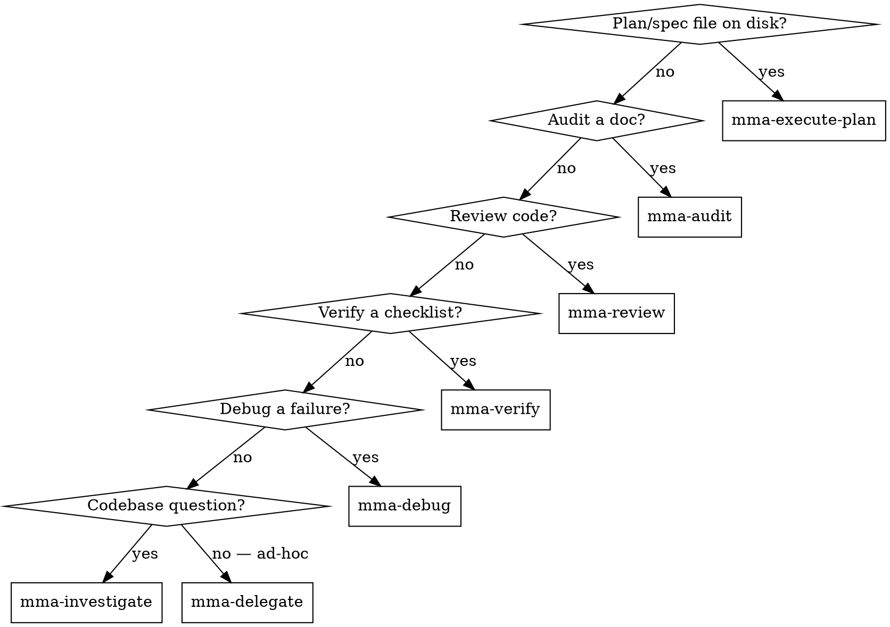

# multi-model-agent (router)

## Overview

Local HTTP service that fans out tool-using work to sub-agents on different LLM providers (Claude, OpenAI-compatible, Codex). Workers run on cheap models; the main agent stays on judgment.

**Core principle:** Pick the most specific `mma-*` skill that fits the task. Specificity reduces input — specialized skills know their route, schema, and defaults so you write less.

## Skill map



| Skill | Purpose |
|---|---|
| `mma-execute-plan` | Implement tasks from a plan or spec file (descriptors match plan headings) |
| `mma-audit` | Audit a document/spec/config for security, correctness, style, or performance |
| `mma-review` | Review code for quality, security, performance, correctness |
| `mma-verify` | Verify work against a checklist (one item per worker, parallel) |
| `mma-debug` | Debug a failure with a structured hypothesis |
| `mma-investigate` | Codebase Q&A — structured answer with `file:line` citations + confidence |
| `mma-delegate` | Ad-hoc implementation / research with no plan file |
| `mma-retry` | Re-run specific failed/incomplete tasks from a previous batch by index |
| `mma-context-blocks` | Register a reused doc once; reference by ID across N tasks |
| `mma-clarifications` | Confirm or correct the service's proposed interpretation |

## Preflight: auto-start the daemon if it is not running

```bash
PORT=7337
if ! curl -sf "http://127.0.0.1:$PORT/health" >/dev/null 2>&1; then
  mmagent serve >/dev/null 2>&1 &
  disown
  for _ in 1 2 3 4 5 6 7 8 9 10; do
    sleep 0.5
    curl -sf "http://127.0.0.1:$PORT/health" >/dev/null 2>&1 && break
  done
fi
```

Idempotent: already-running daemon → curl succeeds → no-op.

❌ `mmagent serve` (no `&`) — blocks forever, never reaches the next step.
✅ `mmagent serve >/dev/null 2>&1 & disown` — backgrounded, releases the shell.

## Auth token

```bash
export MMAGENT_AUTH_TOKEN=$(mmagent print-token)
```

Every request requires `Authorization: Bearer $MMAGENT_AUTH_TOKEN`. The token rotates on every `mmagent serve` restart — re-export after a `pkill`/upgrade.

## Worker tier: `agentType`

`mma-delegate` and `mma-execute-plan` accept `agentType: "standard" | "complex"`. Default is `"standard"` (cheaper, faster). Pick `"complex"` when:

- The task touches many files or requires multi-step reasoning a standard-tier model cannot hold in context.
- A prior standard run came back with `filesWritten: 0` or `incompleteReason: "turn_cap"` / `"cost_cap"` / `"timeout"`.
- The task is security-sensitive or ambiguous enough that being wrong is costly.

`mma-audit`, `mma-review`, `mma-debug`, `mma-investigate` already default to complex; `mma-verify` already defaults to standard. These are not caller-configurable.

## General flow

1. Call the matching `mma-*` skill → receive `{ batchId, statusUrl }`.
2. Poll `GET /batch/:id`: `202 text/plain` while pending (body is the running headline), `200 application/json` on terminal.
3. Read `results` / `error` / `proposedInterpretation` from the 7-field terminal envelope.

If `proposedInterpretation` is a string (not the `not_applicable` sentinel) → use `mma-clarifications` to confirm/correct.

## Common pitfalls

❌ **Defaulting to inline Agent dispatch when mmagent is up.** mmagent workers cost ~10× less and don't pollute main context. **Why:** every inline tool call burns flagship-model tokens; that's exactly what mmagent exists to avoid.

❌ **Picking `mma-delegate` when a more specific skill fits.** Audit / review / verify / debug / investigate workers know their route's defaults and emit structured reports. **Why:** specialized skills require less input and produce richer output.

❌ **Starting an investigation that needs to write code.** `mma-investigate` is read-only. **Fix:** dispatch `mma-delegate` with research-then-edit framing, or split: investigate → digest → edit.

## Diagnosing slow tasks

`mmagent serve --verbose` (or `diagnostics.verbose: true` in config) records `tool_call`, `turn_complete`, and `heartbeat` events. Tail with `mmagent logs --follow --batch=$BATCH_ID`.
