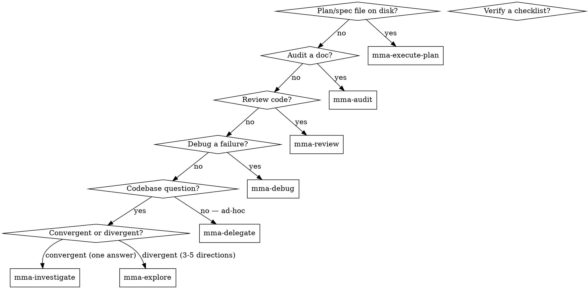

# multi-model-agent (router)

## Overview

Local HTTP service that fans out tool-using work to workers on different LLM providers (Claude, OpenAI-compatible, Codex). Workers run on cheap models; the main agent stays on judgment.

**Core principle:** Pick the most specific `mma-*` skill that fits the task. Specificity reduces input — specialized skills know their route, schema, and defaults so you write less.

## Skill map



| Skill | Purpose |
|---|---|
| `mma-execute-plan` | Implement tasks from a plan or spec file (descriptors match plan headings) |
| `mma-audit` | Audit a document/spec/config for security, correctness, style, or performance |
| `mma-review` | Review code for quality, security, performance, correctness. Pass acceptance checklists in the brief if you need verification-style checks. |
| `mma-debug` | Debug a failure with a structured hypothesis |
| `mma-investigate` | Codebase Q&A — structured answer with `file:line` citations + confidence |
| `mma-explore` | Divergent ideation from codebase + web research — use before `superpowers:brainstorming` |
| `mma-delegate` | Ad-hoc implementation / research with no plan file |
| `mma-retry` | Re-run specific failed/incomplete tasks from a previous batch by index |
| `mma-context-blocks` | Register a reused doc once; reference by ID across N tasks |

## Best practices

### The unifying principle

The main session is for judgment, orchestration, and dialogue with the engineer. Everything else — read, grep, audit, review, debug, implement, verify — gets delegated. If you're about to do labor in main context, you've already taken the wrong turn.

### Judgment vs labor — what NEVER delegates

Labor handles work whose answer is findable from the inputs. Main session keeps work whose answer is **judgment** — there is no "right answer" a worker could discover:

- **Brainstorming** — exploring the problem space with the engineer before a spec exists.
- **Spec writing** — deciding what to build, what success looks like, what's out of scope.
- **Plan writing** — turning a spec into ordered, testable steps with the right decomposition.
- **Architecture and design decisions** — choosing the shape of the solution.
- **Final approval / merge decisions** — what ships.
- **Dialogue with the engineer** — clarifying intent, negotiating tradeoffs, answering "should we?".

The test: *if a worker can produce the answer from the given inputs, delegate; if the answer requires deciding what the inputs should be, it's main-session work.* Recipes A–D all keep these judgment steps in main context (e.g., Recipe C explicitly: `mma-investigate` → **write the plan (main)** → `mma-execute-plan`).

### C1 — Delegate by default, inline by exception

If a task needs 3+ file reads or any grep, it goes to a worker. Inline `Read` is reserved for files already in context, single-file lookups, or 1-2 file reads with a known target.

### C2 — Parallel for independence, sequential for iteration

Independent fan-out (5 unrelated audits, 5 unrelated bugs) → parallel batch. Coupled rounds where round N's fix produces round N+1's input (audit → fix → re-audit, debug → fix → verify) → sequential.

### C3 — Shared content lives in a context block, not in caller tokens

Any artifact (spec, plan, prior-round findings, long error log) that crosses 2+ calls gets registered once via `mma-context-blocks` and referenced by ID.

### Recipe A — Audit-iterate-clean

`mma-audit` → read findings → fix (inline if 1-2 lines, else `mma-delegate`) → `mma-audit` again. Sequential rounds, NOT parallel re-audits. The fix produces new edges; round 2 catches what round 1 couldn't see. Register the doc as a context block before round 1; reuse the same ID across all rounds. The same shape applies to `mma-review` for source code (review → fix → re-review).

### Recipe B — Debug-fix-review

`mma-debug` (read/reproduce/trace) → `mma-delegate` (apply the fix the hypothesis implies) → `mma-review` with the acceptance criteria included in the brief. Three skills, strict order. Register the failing test output / reproduction log as a context block before the debug call; reuse it on the review call so the reviewer can compare against the same evidence.

### Recipe C — Investigate-plan-execute

`mma-investigate` (codebase Q&A) → write the plan (main-context judgment task) → `mma-execute-plan` (workers implement against named plan headings) → `mma-retry` on any failed indices. Register the plan file as a context block before execute-plan; the retry call inherits the same configuration including `contextBlockIds`.

### Recipe D — Plan-execute-retry

When `mma-execute-plan` returns mixed `done` / `done_with_concerns` / `failed`, the next step is `mma-retry` on the failed indices only — never a full-batch re-dispatch. Pass the **original `batchId`** as input, specify the failed task indices, keep the same configuration. (`mma-retry` produces a NEW `batchId` in its response — poll that one for terminal state, not the original.) Any `contextBlockIds` registered for the original batch carry forward into retry — no need to re-register.

### Anti-patterns

1. **`parallel-rounds-same-target`** — Caller fans out 3 parallel calls of the same skill on the same target — `mma-audit` on one document, or `mma-review` on the same source file. The reports overlap heavily; later rounds never see the fix from earlier rounds, so they re-flag the same issues. Corrective: sequential rounds with a fix between each (Recipe A).

2. **`inline-labor-leakage`** — Caller does 3+ `Read` calls, or any `grep`, in main context "just to understand the situation." Main tokens get burned on labor; the answer the caller actually needs is one paragraph of synthesis. Corrective: `mma-investigate` for codebase Q&A; if the goal is implementation, jump straight to `mma-delegate` with file paths and let the worker read.

3. **`re-inlined-shared-content`** — Caller pastes the same spec / plan / error log into 5 task prompts in one batch (or across rounds). Token cost scales linearly with N. Corrective: `mma-context-blocks` register once, pass `contextBlockIds` to every task. C3 fires the moment the same content is referenced a second time.

4. **`full-batch-redispatch`** — Caller re-runs `mma-execute-plan` with the entire task list when only 2 of 8 tasks failed. The 6 successful tasks get re-charged. Corrective: `mma-retry` with the failed indices. (The same anti-pattern applies to multi-task `mma-delegate` batches; `mma-retry` is the corrective there too.)

## Preflight: auto-start the daemon if it is not running

```bash
PORT=7337
if ! curl -sf "http://127.0.0.1:$PORT/health" >/dev/null 2>&1; then
  mmagent serve >/dev/null 2>&1 & disown
  for _ in 1 2 3 4 5 6 7 8 9 10; do
    sleep 0.5
    curl -sf "http://127.0.0.1:$PORT/health" >/dev/null 2>&1 && break
  done
fi
```

Idempotent: already-running daemon → curl succeeds → no-op. Background `mmagent serve` (with `& disown`) — never run it foreground (it would block the rest of the script).

## Auth token

```bash
export MMAGENT_AUTH_TOKEN=$(mmagent print-token)
```

Every request requires `Authorization: Bearer $MMAGENT_AUTH_TOKEN`. The token rotates on every `mmagent serve` restart — re-export after a `pkill`/upgrade.

## Worker tier: `agentType`

Only `mma-delegate` accepts `agentType: "standard" | "complex"` per task — default `"standard"` (cheaper, faster). Pick `"complex"` when:

- The task touches many files or requires multi-step reasoning a standard-tier model cannot hold in context.
- A prior standard run came back with `filesWritten: 0` or `incompleteReason: "turn_cap"` / `"timeout"`.
- The task is security-sensitive or ambiguous enough that being wrong is costly.

Every other route hardcodes its tier and rejects `agentType` with HTTP 400:

| Route | Hardcoded tier |
|---|---|
| `mma-execute-plan` | `standard` |
| `mma-audit` | `complex` |
| `mma-review` | `complex` |
| `mma-debug` | `complex` |
| `mma-investigate` | `complex` |
| `mma-explore` | `complex` (all three workers — internal, external, synthesizer) |

If you need `complex` tier on plan-style work, dispatch via `mma-delegate` with the plan task as the prompt and `agentType: "complex"`.

## Context block defaults

| Default | Value | Notes |
|---|---|---|
| Idle TTL | 24 h | Block eligible for eviction after 24 h with no active batch references |
| `maxEntries` | 500 | Per-project cap on total context blocks |
| Body cap | 50 MiB | Maximum `content` size per block |

Context blocks are immutable after creation. To update content, register a new block and switch `contextBlockIds` to the new ID.

## Terminal context block

Every completed task across all routes automatically registers a terminal markdown context block with the full task report. The `blockId` is in each task result as `terminalBlockId`. This block is immutable, lives for the session duration (or idle-evicts after 24 h), and counts against the `maxEntries` quota. Use `terminalBlockId` values in downstream `contextBlockIds` to chain findings across workflow steps without re-inlining report content. No caller action needed — blocks are registered server-side at task completion.

## General flow

1. Call the matching `mma-*` skill → receive `{ batchId, statusUrl }`.
2. Poll `GET /batch/:id`: `202 text/plain` while pending (body is the running headline), `200 application/json` on terminal.
3. Read `results` / `error` from the 6-field terminal envelope.

## Common pitfalls

❌ **Defaulting to inline Agent dispatch when mmagent is up.** mmagent workers cost ~10× less and don't pollute main context. **Why:** every inline tool call burns flagship-model tokens; that's exactly what mmagent exists to avoid.

❌ **Picking `mma-delegate` when a more specific skill fits.** Audit / review / verify / debug / investigate workers know their route's defaults and emit structured reports. **Why:** specialized skills require less input and produce richer output.

❌ **Starting an investigation that needs to write code.** `mma-investigate` is read-only. **Fix:** dispatch `mma-delegate` with research-then-edit framing, or split: investigate → digest → edit.

## Diagnosing slow tasks

`mmagent serve --verbose` (or `diagnostics.verbose: true` in config) records `tool_call`, `turn_complete`, and `heartbeat` events. Tail with `mmagent logs --follow --batch=$BATCH_ID`.
