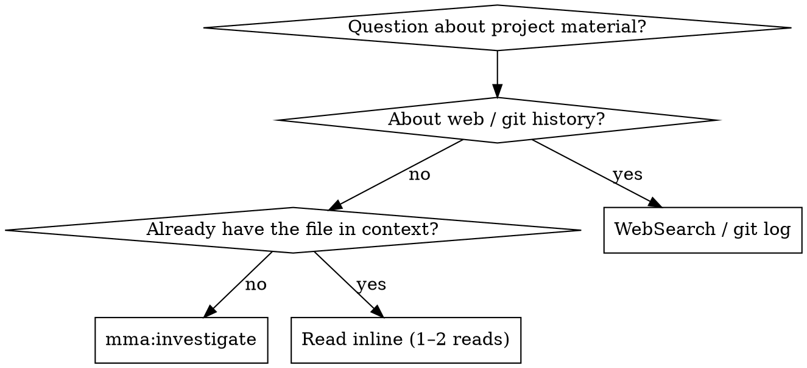

# mma:investigate

## Overview

Answer a project question via a read-only mma worker. The subject may be source code, or it may be
non-code material — configuration, specifications, data files, spreadsheets, or documents. The
worker greps and reads on its cheap budget; you read its synthesis on yours.

**Core principle:** Investigation is labor (read, grep, synthesize). Delegate it. The main agent stays on judgment — deciding what the answer means and what to do with it.

## When to Use



**Use when:**
- "How does X work in this codebase?" (or in this spreadsheet, config bundle, or document set)
- "Where is Y called from?"
- "What does this directory do?"
- The answer requires reading 3+ files or grepping
- Cross-cutting investigations (auth flow across modules, data lineage)

**Don't use when:**
- The answer is in 1–2 files you already have in context → just `Read`
- It's about web docs / external APIs → `WebSearch` / `WebFetch`
- It's about git history → `git log` / `git blame`
- You need to MODIFY code based on the finding → `mma:delegate` (research + edit)
- You want to consider multiple distinct directions, not converge on one answer → `mma:explore` (divergent ideation, codebase + web)

## Dispatch

Call the `mma_run` MCP tool with `cwd` and a `request` body (below). If the `mma_run` MCP tool
is not available in this session, run `mma clients`.

## Request body

```json
{
  "type": "investigate",
  "prompt": "How does the auth middleware handle token refresh?",
  "target": { "paths": ["/project/src/auth/"] },
  "contextBlockIds": []
}
```

| Field | Type | Required | Notes |
|---|---|---|---|
| `prompt` | string | yes | Natural-language investigation question (min 1 char) |
| `target.paths` | string[] | no | Anchor paths the worker starts from. Worker may grep beyond. |
| `contextBlockIds` | string[] | no | IDs from `mma:context-blocks` (max 2) — enables follow-up / delta investigation |

> Worker tier defaults to `complex`. Send `agentTier` to override if needed.

**Anchor narrow questions with `target.paths`:**

❌ `{ "prompt": "Where is parseConfig called?" }` — searches the whole repo
✅ `{ "prompt": "Where is parseConfig called?", "target": { "paths": ["src/"] } }` — bounded

**Why:** the worker greps and reads under a turn and wall-clock budget. Without anchors, broad questions exhaust those budgets before they finish.

## Full example

Call `mma_run` with:

```json
{ "cwd": "/project", "request": { "type": "investigate", "prompt": "How does the auth middleware handle token refresh?" } }
```

## Response shapes

### mma_run — dispatch

Short tasks return the terminal envelope (below) inline, in the tool result. Longer-running
tasks return a handle instead:

```json
{ "executionId": "<uuid>", "type": "<route>", "cwd": "<abs path>" }
```

Use `executionId` to poll with `mma_execution_get` / `mma_execution_wait`.

### mma_execution_get / mma_execution_wait — poll

A still-running execution returns identity plus progress (`status: "running"`, `phase`,
`elapsedMs`, `runningHeadline`, …) — not the shape below. A terminal execution returns the
full envelope — these 5 top-level fields:

```json
{
  "execution": {
    "executionId": "<uuid>",
    "type": "<route>",
    "subtype": "<subtype or absent>",
    "status": "done | done_with_concerns | failed | cancelled",
    "sessions": { "implementer": "<session-id>", "reviewer": "<session-id or null>" },
    "worktree": null,
    "dirtyAtDispatch": false
  },
  "output": {
    "summary": { /* refiner JSON — shape varies by route, see below */ },
    "filesChanged": ["src/foo.ts", "src/bar.ts"],
    "contextBlockId": "<string or null>",
    "reviewerNote": null
  },
  "metrics": {
    "totalDurationMs": 12400,
    "totalCostUsd": 0.08,
    "implementer": { "durationMs": 8000, "costUsd": 0.05, "usage": { "inputTokens": 1200, "outputTokens": 800, "cachedReadTokens": 0, "cachedNonReadTokens": 0 } },
    "reviewer":     { "durationMs": 4000, "costUsd": 0.03, "usage": { "inputTokens": 900, "outputTokens": 400, "cachedReadTokens": 0, "cachedNonReadTokens": 0 } }
  },
  "raw": {
    "implementer": "<raw text output>",
    "reviewer": "<raw text output or null>"
  },
  "error": null
}
```

`execution` is the ONE merged top-level section — there is no separate `task` section. It
carries the execution's own identity (`executionId`, `type`, `status`) alongside what used to
live in a distinct `execution` block (`sessions`, `worktree`, `dirtyAtDispatch`). `subtype`
(audit's criteria set) is optional — read it defensively.

### How to read the envelope

**Step 1 — check `error`:**

| Shape | Meaning |
|---|---|
| `error` is `null` | Task succeeded — read `output` |
| `error` is `{ "code": "...", "message": "..." }` | Task failed — read `error.code` + `error.message` |

**Step 2 — extract the result from `output.summary`:**

`output.summary` is the **parsed JSON** from the refiner (reviewer). Its internal shape varies by route — see the per-skill "Reading the output" section for the exact fields. Common patterns:

| Route family | What `output.summary` contains |
|---|---|
| Read routes (audit, review, investigate, debug, research) | `{ findings: [...], criteriaCovered: [...], ... }` — findings array is the main payload |
| Write routes (delegate, execute_plan) | `{ status: 'done'\|'failed', notes }` or `{ tasks: [...], notes }` |
| Spec / Plan | `{ specPath, sections, acceptanceCriteriaCount, notes }` or `{ planPath, taskCount, tasks, notes }` |
| Journal recall | `{ answer, criteriaCovered, findings: [{ weight, category, claim, evidence, topic, fallback, nodeId, nodePath }] }` |
| Journal record | `{ recorded: [...], failed: [...] }` |

**Step 3 — for read routes, extract findings:**

```
response.output.summary.findings   ← the findings array
response.output.summary.findings[i].weight      ← "critical" | "high" | "medium" | "low"
response.output.summary.findings[i].category
response.output.summary.findings[i].claim       ← one-sentence summary
response.output.summary.findings[i].evidence    ← grounding text
response.output.summary.findings[i].suggestion  ← fix recommendation (some routes omit this)
```

**Step 4 — for write routes, read files changed:**

```
response.output.filesChanged       ← array of relative paths modified by the worker
response.output.contextBlockId     ← non-null for read routes (reusable in contextBlockIds)
```

**Step 5 — check `output.reviewerNote` (reviewer availability):**

`output.reviewerNote` is `null` on the normal path. When the reviewer ran but its output
couldn't be parsed, the task degrades to `status: "done_with_concerns"` with **`error: null`**
(a reviewer format flake is a concern, not a failure), and `output.summary` falls back to the
**implementer's** answer. `reviewerNote` then carries the reason:

```json
"reviewerNote": { "code": "reviewer_unavailable", "message": "<why the parse failed>" }
```

Treat a non-null `reviewerNote` as advisory: the answer in `output.summary` is the un-refined
implementer output, still usable. Never discard the task on `reviewerNote` alone.

### Common extraction mistakes

❌ **Reading `output.findings`** — this field does NOT exist. Findings are inside `output.summary.findings`.

❌ **Reading `results` or `structuredReport`** — these are legacy field names from older API versions. The current envelope uses `output.summary`.

❌ **Treating `output.summary` as a string** — it is parsed JSON (an object), not a string. If it looks like a string, the underlying output could not be parsed at all — check `output.reviewerNote` and, as a last resort, `raw.implementer`.

❌ **Ignoring `error: null` check** — a `status: "done_with_concerns"` task has `error: null` and is a success (advisory concerns only). Only `error !== null` is a failure. In particular, when a reviewer emits non-JSON, the task is `done_with_concerns` with `error: null`, `output.summary` holds the implementer answer, and `output.reviewerNote` explains the degrade — do NOT treat this as a failure.

### Tool call error

A malformed or unresolvable call (bad `cwd`, unknown `executionId`, failed admission) surfaces as an
MCP tool error rather than a terminal envelope — the tool result carries `isError: true` and this
payload:

```json
{ "error": { "code": "<code>", "message": "<human-readable>" } }
```

This is a different signal than Step 1 above: it means the call itself could not be admitted or
resolved, not that a dispatched task ran and failed. A dispatched task's failure always shows up
in the terminal envelope's `error` field instead.


## Best practices

This skill is one step in the larger flow described in `multi-model-agent` → "Best practices". Recipes that involve `mma:investigate`:

- **Recipe C — Investigate-plan-execute.** `mma:investigate` → write the plan → `mma:execute-plan`. The investigation produces the synthesis you need to write the plan; the plan becomes a context block for execute-plan.

Anti-pattern alert: **`inline-labor-leakage`** (AP2). If you find yourself reading 3+ files or running any grep in main context, that's the trigger to delegate here instead. Main-context tokens cost ~10× more than worker tokens, and you only need the synthesis, not the raw reads.

## Common pitfalls

❌ **Asking for a fix instead of an answer**
> prompt: "Refactor the auth middleware to use JWT"

The investigator can't write — `tools: 'readonly'`. **Fix:** use `mma:delegate` for research-then-edit, or split: investigate first, then dispatch the edit.

❌ **Inline-reading instead of delegating**
About to `Read` 3+ files just to answer one question? That's the wrong tradeoff — the worker reads on its cheap budget; you read its synthesis on yours.

## Terminal context block

Every completed **read-route** task (audit / review / debug / investigate / research) auto-registers a reusable terminal context block containing its report (headline + findings). The block id is returned on the result as **`contextBlockId`**. Write routes (delegate / execute-plan) return `contextBlockId: null` — their record is the commit, not a block. This block is immutable, lives for the session duration, and counts against the project's `maxEntries` quota (default 500).

Use it for delta follow-ups — feed prior results' block ids into a later call's `contextBlockIds`, filtering out nulls:

    contextBlockIds: priorResults.map(r => r.contextBlockId).filter((id) => id !== null)

**Use cases:**
- Pass investigation results to a downstream planning step
- Feed codebase findings into `mma:execute-plan` as shared context
- Carry investigation context forward through the investigate → plan → execute chain

The block is registered server-side at task completion; no caller action is needed to create it. Delete it explicitly via `DELETE /context-blocks/:id` when no longer needed, or let it expire on session teardown.

## Outcome semantics

**Success vs failure:** Check `error` in the terminal envelope. `error === null` means the task succeeded — read `output.summary`. `error !== null` (with `code` + `message`) means it failed.

**Empty findings is not a failure.** An investigation that finds nothing is a success — it answers "I found no evidence for that in the codebase." Check `output.summary.findings.length === 0`. The `output.summary.answer` field contains the narrative answer.
