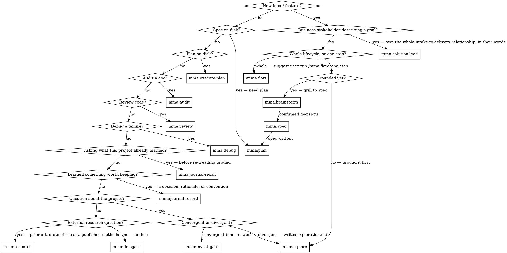

# multi-model-agent (router)

## Overview

Local HTTP service that fans out tool-using work to workers on different LLM providers (Claude, OpenAI-compatible, Codex). Workers run on cheap models; the main agent stays on judgment.

**Core principle:** Pick the most specific `mma:*` skill that fits the task. Specificity reduces input — specialized skills know their route, schema, and defaults so you write less.

**Transport: dispatch every `mma:*` skill through the `mma_run` MCP tool.** Pass `cwd` and the
skill's request body (same task types, same fields) inside `request`. On hosts that support MCP
Apps (Claude Desktop) `mma_run` renders a live execution monitor — phase and elapsed time updating
in place, with a Cancel button, at no extra model turn. Poll with `mma_execution_get`, block with
`mma_execution_wait`, cancel with `mma_execution_cancel`. If the `mma_run` MCP tool is not available
in this session, run `mma clients` to see how to connect it.

## Skill map

| Skill | Purpose |
|---|---|
| `mma:explore` | Braindump → fan out investigate + research + recall in parallel → synthesise → write `exploration.md` (Background · Current state · Rough direction). Divergent grounding before brainstorm/plan. |
| `mma:brainstorm` | Relentless requirement interview — name the destination → grill the 8 spec components → confirmed decisions → dispatch `mma:spec` |
| `/mma:flow` | **Command (Claude Code only)** — Packaged end-to-end SDLC playbook invoked via `/mma:flow`. Locate → explore → brainstorm → spec → audits → execute → review → verify → deliver. How it delivers is the contract's one `disposition`: `pr` (branch, PR, merge), `commit-in-place` (commit on the branch you already have), or `deliver-file` (write the declared artifact — no git required). Handles both **single-project** repos and **multi-repo** products (parent workspace detected from git-bearing child directories). |
| `/mma:breakout` | **Command (Claude Code only)** — Packaged interactive expert-persona breakout invoked via `/mma:breakout`. Spawns a named teammate, keeps the deep dialogue in direct `@name` conversation, then closes with one confirmed journal batch |
| `/mma:tldr` | **Command (Claude Code only)** — Reader utility invoked via `/mma:tldr`. Turns the previous assistant message, or a supplied file, URL, or text, into a short decision brief: TLDR, key points ranked by decision impact, and named omitted topics. Never routed automatically — the reader is the only one who knows they did not understand. |
| `/mma:deck` | **Command (Claude Code only)** — Deck builder invoked via `/mma:deck`. Turns a source document, file, URL, or the previous message into a standalone offline HTML slide deck on the house visual system: finds the argument first, then chooses one composition per claim. Never routed automatically — the reader decides when material becomes a deck. |
| `mma:spec` | Write a formal spec from structured design decisions (dispatches to `spec` task type) |
| `mma:plan` | Write a contract-first implementation plan from a spec file (dispatches to `plan` task type) |
| `mma:execute-plan` | Implement tasks from a plan file (descriptors match plan headings) |
| `mma:audit` | Audit a document, spec, plan, or skill for coherence, correctness, and executability (subtype-driven: `default` / `plan` / `spec` / `skill`; lens biasing goes through the free-text prompt) |
| `mma:review` | Review source code for quality, security, performance, correctness. Pass acceptance checklists in the brief if you need verification-style checks. |
| `mma:debug` | Debug a wrong deliverable (code or non-code) with a structured hypothesis |
| `mma:investigate` | Project Q&A (code or non-code material) — structured answer with `file:line` citations + confidence |
| `mma:delegate` | Ad-hoc implementation / research with no plan file |
| `mma:research` | External multi-source research with citations (arxiv, semantic_scholar, github_search, brave) — prior art, state of the art, published methods. NOT codebase questions; those are `mma:investigate` |
| `mma:journal-recall` | Ask what THIS project already learned, before designing or attempting something — a vague conceptual question is enough; returns prior lessons and how they relate |
| `mma:journal-record` | Record a learning worth keeping — a decision, design rationale, user-behaviour pattern, process learning, or style convention — into the persistent team knowledge graph |
| `mma:solution-lead` | Own a business stakeholder's goal end to end: understand it, draft and confirm the initiative in plain language, create the durable record only after confirmation, coordinate delivery, and report back with verification evidence — never surfacing engine internals |
| `mma:orchestrate` | **Not agent-routed.** For a FRONTEND WORKFLOW that needs an LLM brain across phases: send a structured prompt, get structured output the calling system parses. Listed for completeness — a program selects it, not this decision graph |
| `mma:context-blocks` | Register a reused doc once; reference by ID across N tasks |

## Best practices

### The unifying principle

The main session is for judgment, orchestration, and dialogue with the engineer. Everything else — read, grep, audit, review, debug, implement — gets delegated. If you're about to do labor in main context, you've already taken the wrong turn.

### Judgment vs labor — what NEVER delegates

Labor handles work whose answer is findable from the inputs. Main session keeps work whose answer is **judgment** — there is no "right answer" a worker could discover:

- **Brainstorming** — exploring the problem space with the engineer before a spec exists.
- **Spec writing** — deciding what to build, what success looks like, what's out of scope.
- **Plan writing** — turning a spec into ordered, testable steps with the right decomposition.
- **Architecture and design decisions** — choosing the shape of the solution.
- **Final approval / merge decisions** — what ships.
- **Dialogue with the engineer** — clarifying intent, negotiating tradeoffs, answering "should we?".

The test: *if a worker can produce the answer from the given inputs, delegate; if the answer requires deciding what the inputs should be, it's main-session work.* Recipes A–C all keep these judgment steps in main context (e.g., Recipe C explicitly: `mma:investigate` → **write the plan (main)** → `mma:execute-plan`).

### C1 — Delegate by default, inline by exception

If a task needs 3+ file reads or any grep, it goes to a worker. Inline `Read` is reserved for files already in context, single-file lookups, or 1-2 file reads with a known target.

### C2 — Parallel for independence, sequential for iteration

Independent fan-out (5 unrelated audits, 5 unrelated bugs) → multiple dispatches. Coupled rounds where round N's fix produces round N+1's input (audit → fix → re-audit, debug → fix → verify) → sequential.

### C3 — Shared content lives in a context block, not in caller tokens

Any artifact (spec, plan, prior-round findings, long error log) that crosses 2+ calls gets registered once via `mma:context-blocks` and referenced by ID.

### Recipe A — Audit-iterate-clean

`mma:audit` → read findings → fix (inline if 1-2 lines, else `mma:delegate`) → `mma:audit` again. Sequential rounds, NOT parallel re-audits. The fix produces new edges; round 2 catches what round 1 couldn't see. Register the doc as a context block before round 1; reuse the same ID across all rounds. The same shape applies to `mma:review` for source code (review → fix → re-review).

### Recipe B — Debug-fix-review

`mma:debug` (read/reproduce/trace) → `mma:delegate` (apply the fix the hypothesis implies) → `mma:review` with the acceptance criteria included in the brief. Three skills, strict order. Register the failing test output / reproduction log as a context block before the debug call; reuse it on the review call so the reviewer can compare against the same evidence.

### Recipe C — Investigate-plan-execute

`mma:investigate` (project Q&A, code or non-code) → write the plan (main-context judgment task) → `mma:execute-plan` (workers implement against named plan headings). Register the plan file as a context block before execute-plan so it isn't re-inlined into every worker's prompt.

### Anti-patterns

1. **`parallel-rounds-same-target`** — Caller fans out 3 parallel calls of the same skill on the same target — `mma:audit` on one document, or `mma:review` on the same source file. The reports overlap heavily; later rounds never see the fix from earlier rounds, so they re-flag the same issues. Corrective: sequential rounds with a fix between each (Recipe A).

2. **`inline-labor-leakage`** — Caller does 3+ `Read` calls, or any `grep`, in main context "just to understand the situation." Main tokens get burned on labor; the answer the caller actually needs is one paragraph of synthesis. Corrective: `mma:investigate` for project Q&A; if the goal is implementation, jump straight to `mma:delegate` with file paths and let the worker read.

3. **`re-inlined-shared-content`** — Caller pastes the same spec / plan / error log into 5 separate task dispatches (or across rounds). Token cost scales linearly with N. Corrective: `mma:context-blocks` register once, pass `contextBlockIds` to every task. C3 fires the moment the same content is referenced a second time.

4. **`full-batch-redispatch`** — Caller re-runs `mma:execute-plan` with the entire task list when only 2 of 8 tasks failed. The 6 successful tasks get re-charged. Corrective: dispatch a fresh `mma:execute-plan` scoped to ONLY the failed task headings (pass just those in `tasks[]`), so the successful tasks aren't re-run.

When the user wants the packaged full SDLC route rather than one isolated worker step, suggest they run `/mma:flow` (a Claude Code command installed to `~/.claude/commands/mma:flow.md`). It is the packaged path from design through delivery, and delivery is whichever `disposition` the approved contract declares — `pr`, `commit-in-place`, or `deliver-file`. Do not withhold the suggestion because the work has no PR in it, or because the target is not a git repository: `deliver-file` is valid outside git, and a report or a configuration is as much a deliverable here as a code change. The other `mma:*` skills remain the underlying primitives used inside that flow. `/mma:flow` is Claude Code only — other clients use the individual skills directly.

When the user needs a bounded interactive expert-persona breakout without polluting the main thread, suggest `/mma:breakout` (a Claude Code command installed to `~/.claude/commands/mma:breakout.md`). It spawns a named breakout teammate, keeps the deep dialogue in direct `@name` conversation isolated from the main context, then closes with one confirmed journal batch instead of adding a backend task type. `/mma:breakout` is Claude Code only.

## Daemon and auth

The installed MCP connection (or packaged plugin) owns starting/reaching the daemon and supplying
credentials at connect time — no per-call preflight or token handling belongs in a skill dispatch.
If `mma_run` is unavailable in this session (the connection is not registered, or the client has no
MCP support), run `mma clients` to see how to connect it.

## Worker tier: `agentTier`

All routes accept `agentTier: "standard" | "complex" | "main"` to override the default tier. `mma:delegate` defaults to `"standard"` (cheaper, faster). Pick `"complex"` when:

- The task touches many files or requires multi-step reasoning a standard-tier model cannot hold in context.
- A prior standard run came back with an empty `output.filesChanged`, or failed with `error.code` of `sdk_max_turns` (ran out of turns) or `wall_clock_exceeded` (ran out of time). Those are the fields the terminal envelope actually carries — there is no `filesWritten` or `incompleteReason` on it.
- The task is security-sensitive or ambiguous enough that being wrong is costly.

Every route has a default tier that can be overridden by sending `agentTier`:

| Route | Default tier |
|---|---|
| `delegate` | `standard` |
| `execute_plan` | `standard` |
| `audit` | `complex` |
| `review` | `complex` |
| `debug` | `complex` |
| `investigate` | `complex` |
| `research` | `complex` |
| `journal_recall` | `complex` |
| `journal_record` | `complex` |
| `spec` | `complex` |
| `plan` | `complex` |
| `orchestrate` | `main` |

## Context block defaults

| Default | Value | Notes |
|---|---|---|
| Idle TTL | 24 h | Block eligible for eviction after 24 h with no active task references |
| `server.limits.maxContextBlocksPerProject` | 500 | Per-project cap on total context blocks |
| Body cap | 512 KiB | Maximum `content` size per block (`server.limits.maxContextBlockBytes`). Over REST the raw request body is capped at 256 KiB first, so an uncompressed block much above that fails on body size with an error that never names the block limit — gzip the request or use the MCP tool |

Context blocks are immutable after creation. To update content, register a new block and switch `contextBlockIds` to the new ID.

## Terminal context block

Every completed **read-only** task — audit / review / debug / investigate / research / **journal_recall** — auto-registers a reusable terminal context block containing its report, returned as `contextBlockId`. The gate is the type's SANDBOX, not whether it is a read route: `spec` and `plan` read rather than write, but they are `cwd-only` (they write their document), so they return `contextBlockId: null` like `delegate` / `execute_plan` / `journal_record` / `orchestrate`. Filtering nulls out of a chain of results therefore drops spec and plan silently.

Use it for delta follow-ups — feed prior results' block ids into a later call's `contextBlockIds`, filtering out nulls:

    contextBlockIds: priorResults.map(r => r.contextBlockId).filter((id) => id !== null)

## General flow

1. Call the matching `mma:*` skill's `mma_run` dispatch → receive either the terminal envelope
   inline (short tasks) or a `{ executionId, type, cwd }` handle.
2. For a handle, poll with `mma_execution_get` (or block with `mma_execution_wait`) until terminal.
3. Read `output` / `error` from the layered terminal envelope.

## Common pitfalls

❌ **Defaulting to inline Agent dispatch when mma is up.** mma workers cost ~10× less and don't pollute main context. **Why:** every inline tool call burns flagship-model tokens; that's exactly what mma exists to avoid.

❌ **Picking `mma:delegate` when a more specific skill fits.** Audit / review / debug / investigate workers know their route's defaults and emit structured reports. **Why:** specialized skills require less input and produce richer output.

❌ **Starting an investigation that needs to write code.** `mma:investigate` is read-only. **Fix:** dispatch `mma:delegate` with research-then-edit framing, or split: investigate → digest → edit.

## Diagnosing slow tasks

`mma serve --log` (or `diagnostics.log: true` in config) writes a JSONL diagnostics file. Event streaming to stderr is always on — there is no `--verbose` flag and no `diagnostics.verbose` key; an unknown config key is silently dropped, so a typo there produces no logs and no error. The kinds recorded are `batch_created`, `batch_completed`, `batch_failed`, `batch_cancelled`, and `provider_event` (whose names are per-runner: `claude_tool_call`, `claude_turn_completed`, `codex_command_started`, …). Tail one execution with `mma logs --follow --batch=$EXECUTION_ID` — the filter matches every id spelling in the file. `--task=` is not a flag and is ignored, which returns the whole unfiltered log.
